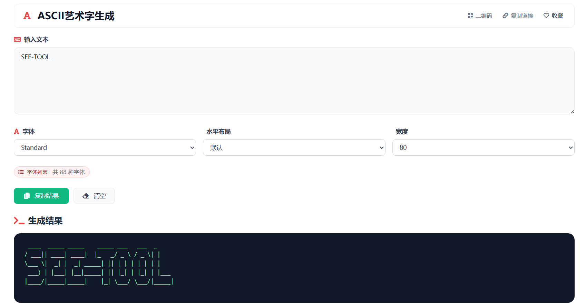

# ASCII艺术字生成 在线工具分享

想把普通文字变得更有趣一点，很多人第一时间会想到艺术字、字符画、个性昵称或者海报标题。为了让这件事更简单，我做了一个 `ASCII艺术字生成` 在线工具，用普通文本就能快速生成有风格的 ASCII 艺术字。

> 在线工具网址：[https://see-tool.com/ascii-art-generator](https://see-tool.com/ascii-art-generator)  
> 工具截图：  
> 

这个工具是我用 Vue 开发的，打开网页就能直接使用，不需要安装软件。对于普通用户来说，它的价值很直接：输入一句话，马上得到更有视觉效果的文字样式，适合拿来装饰昵称、签名、帖子标题或活动文案。

## 这个工具适合哪些场景

- 做社交平台昵称、个性签名
- 给海报标题、帖子标题增加辨识度
- 生成简单的字符画风格文本
- 做活动文案、祝福语、节日短句排版

## 使用方法很简单

1. 输入你想转换的英文或数字内容。
2. 选择喜欢的艺术字字体样式。
3. 按需要调整布局或显示宽度。
4. 生成后直接复制，粘贴到你要使用的地方。

相比自己找模板、手动排版，这种方式更省时间，也更适合不会设计的普通用户。你不需要了解代码，也不用研究字符规则，直接输入文字就能看到效果。

我做这个 Vue 工具时，重点就是让操作足够直观：少步骤、结果清楚、上手快。假如你刚好想做一个更醒目的网名、标题或者祝福文本，这个 ASCII 艺术字生成工具会比较实用。
