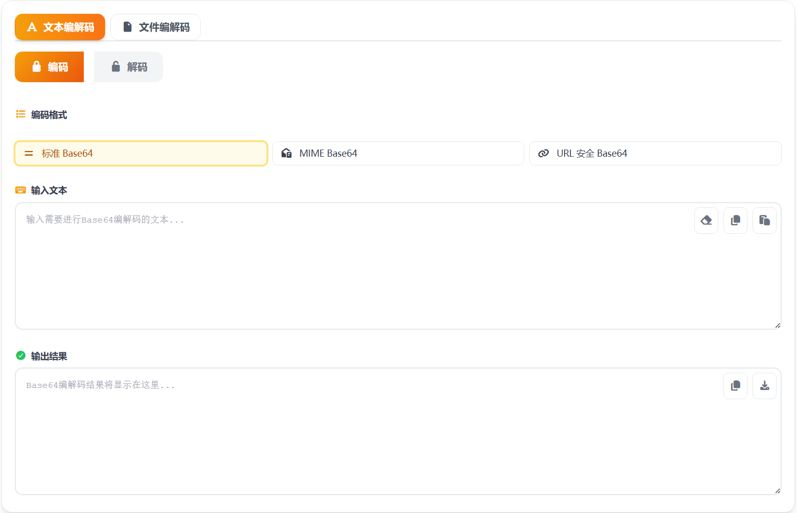

# Base64编码/解码 在线工具分享

平时复制接口参数、处理图片数据、排查报文时，经常会遇到 Base64。很多人知道“要转一下”，但不知道该选哪种格式，也担心数据被上传。为了解决这些小麻烦，我做了一个更直观的在线工具。

这个工具是我用 **Vue 3** 开发的，打开网页就能用，不需要安装软件。

> 在线工具网址：[https://see-tool.com/base64-converter](https://see-tool.com/base64-converter)  
> 工具截图：  
> 

## 这个工具能做什么

- 文本 Base64 编码与解码，一键互转。
- 文件转 Base64，或把 Base64 还原成文件并下载。
- 支持三种常见格式：标准 Base64、MIME（自动换行）、URL Safe（适合放在链接和 Token 中）。
- 复制、粘贴、清空、下载都做成了按钮，日常使用更顺手。

## 怎么用（小白版）

1. 先选“文本”或“文件”模式。
2. 再选“编码”或“解码”。
3. 根据场景选择格式：一般用标准；邮件内容可选 MIME；URL/Token 建议选 URL Safe。
4. 输入内容后结果会自动生成，最后复制或下载即可。

## 适合哪些场景

- 接口调试：快速查看或生成 Base64 参数。
- 前端开发：处理 Data URL、图片字符串。
- 日常办公：把一段编码内容还原成可读文本。

## 我为什么推荐它

核心原因很简单：轻量、直接、上手快。并且所有转换都在浏览器本地完成，内容不会上传到服务器，隐私更放心。

如果你经常会碰到 Base64，这个工具基本可以做到“打开就能用，用完就走”。
