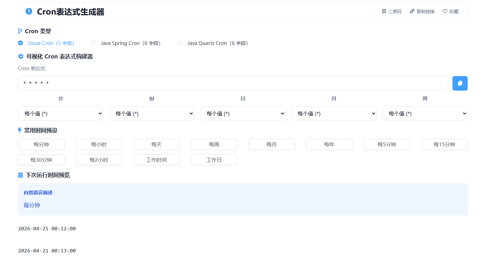

# 在线Cron表达式生成器核心JS实现

这个工具的核心目标很明确：把“可视化字段配置”和“Cron 字符串”做双向同步，并且给出可读描述与下一次运行时间。整体是 Vue2 页面状态驱动 + 纯 JS 规则引擎的组合。

> 在线工具网址：[https://see-tool.com/cron-generator](https://see-tool.com/cron-generator)  
> 工具截图：  
> 

## 一、核心数据模型：统一字段结构

页面初始化时通过 `createFields()` 生成统一字段对象：`second`、`minute`、`hour`、`dayOfMonth`、`month`、`dayOfWeek`。每个字段都保持同一种结构：

- `type`：字段模式（`*`、`?`、`specific`、`range`、`step`、`list`、`last`、`weekday`、`nth`）
- `value`：字段值（如 `5`、`1-5`、`*/10`、`6#2`）

这种统一模型让“构建表达式”和“解析表达式”都围绕同一份状态工作，避免了页面层分散处理。

## 二、Cron 类型差异：用字段数做第一层约束

工具内置三种类型：`linux`、`spring`、`quartz`。关键差异是字段数量和是否含秒：

- `linux`：5 字段
- `spring`、`quartz`：6 字段（含秒）

在 `parseCronExpression` 和 `validateCronExpression` 里，都会先校验字段数量是否匹配。这个前置检查把大量无效输入挡在最外层，后续逻辑只处理结构正确的表达式。

## 三、字段解析：从字符串到语义类型

`parseCronExpression` 会先按空白拆分，再按当前 Cron 类型映射到各字段。每个字段交给 `parseField` 识别具体语义。

`parseField` 的判断顺序很关键：

1. 先识别 `*`、`?`
2. Quartz 下优先识别特殊语法：`L`、`L-2`、`LW`、`15W`、`6L`、`6#2`
3. 再识别通用语法：步长 `/`、范围 `-`、列表 `,`
4. 最后归类为 `specific`

这个顺序保证了复杂语法不会被提前误判成普通范围或列表。

## 四、字段构建：从结构化状态回写表达式

`buildCronExpression` 的职责是稳定、可预测地输出字符串：

- 根据 Cron 类型决定输出 5 字段还是 6 字段
- `type` 为 `*` 或 `?` 直接输出符号
- 其他类型输出 `value`，空值兜底为 `*`
- 最后用空格拼接

页面层通过计算属性 `generatedCronExpression` 获取这个结果，再用深度监听 `fields` 自动回写 `cronExpression`，形成“改字段即改表达式”的实时联动。

## 五、人类可读描述：把表达式翻译成自然语义

`describeCron` 和 `describeField` 负责生成说明文本。核心做法是按“星期 -> 月 -> 日 -> 时 -> 分 -> 秒”的顺序组织语义，再对不同字段类型做细分描述：

- `specific`：具体值
- `range`：区间
- `step`：步长（区分从 `*` 起步还是从指定基数起步）
- `list`：多值集合
- `last`、`weekday`、`nth`：Quartz 特殊日期语义

其中 `getDayOfWeekName` 额外处理了 Quartz 与标准 Cron 的星期编号差异，避免“周几”解释错误。

## 六、下一次运行时间计算：通用引擎 + Quartz 专项算法

`getNextRunTimes` 采用双通道策略：

- 常规表达式：先做格式处理，再交给 `Cron` 引擎计算 `nextRuns`
- Quartz 特殊语法：进入 `_calculateNextRunsQuartz` 自定义计算

### 1）通用通道

在进入 `Cron` 引擎前，会先执行 `_prepareExpressionForCroner`：

- 把 `?` 转成可计算的 `*`
- 对 Quartz 星期数字做映射（`1-7` 到 `0-6`）
- 对某些特殊日期语法做可计算的近似转换

转换后由 `Cron` 引擎给出未来时间点，最终统一格式化为 `yyyy-MM-dd HH:mm:ss`。

### 2）Quartz 特殊语法通道

`_calculateNextRunsQuartz` 专门处理 `L`、`L-n`、`LW`、`nW`、`nL`、`n#m`。实现方式是“时间游标迭代”模型：

- 从当前时刻之后一个最小粒度开始（有秒就加 1 秒，无秒就加 1 分钟）
- 按月、日、时、分、秒逐层匹配
- 日期层借助辅助函数完成复杂计算：
  - `_getLastWorkday`：月末最后工作日
  - `_getNearestWorkday`：指定日最近工作日
  - `_getLastWeekdayOfMonth`：本月最后一个某星期
  - `_getNthWeekday`：本月第 N 个某星期
- 命中后记录时间，继续推进游标直到拿满数量

这条通道的意义是把库不直接支持的语义，在 JS 层补齐成可计算结果。

## 七、页面层交互闭环：输入、解析、反馈

页面层方法把规则引擎串成完整交互：

- `handleManualEdit`：手输表达式后做 800ms 防抖解析
- `parseCron`：把表达式反解到字段状态，驱动 UI 回填
- `applyPreset`：一键应用预设并触发静默解析
- `copyCron`：复制当前表达式

再配合三个计算属性形成输出面：

- `generatedCronExpression`：结构化状态输出字符串
- `cronDescription`：当前表达式说明
- `nextRunTimes`：未来运行时间列表

这样用户无论是“改字段”还是“直接改表达式”，最终都会回到同一套 JS 规则，不会出现两套逻辑各算各的情况。

## 八、实现上的关键点

这个工具的核心 JS 价值不在“拼字符串”，而在三件事：

- 统一数据模型，保证双向转换可逆
- 用严格的语法分类顺序处理 Cron 方言差异
- 用自定义日期算法补齐 Quartz 特殊语义

最终效果是：表达式可构建、可解析、可验证、可解释、可计算，形成一个完整闭环。
