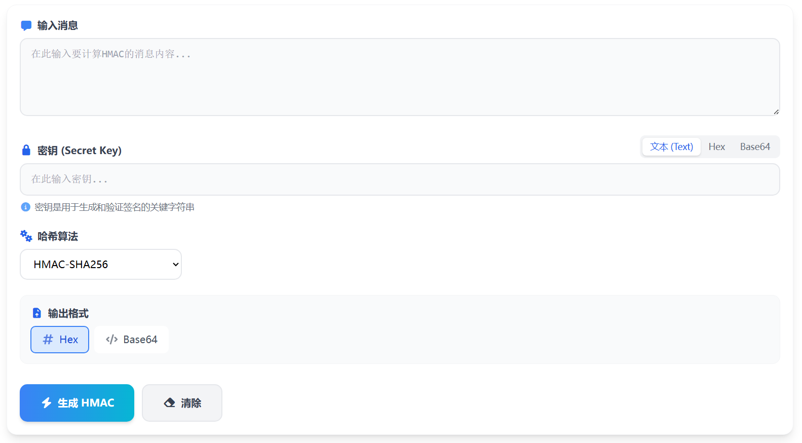

# HMAC在线加密核心JS实现

本文介绍 HMAC 在线加密工具的核心 JavaScript 实现方案，基于 crypto-js 库实现多种哈希算法的 HMAC 计算。

> 在线工具网址：[https://see-tool.com/hmac-encryptor](https://see-tool.com/hmac-encryptor)  
> 工具截图：  
> 

## 算法支持

工具支持以下 HMAC 算法：

| 分组 | 算法 |
|------|------|
| Common | HMAC-MD5 |
| SHA-1 | HMAC-SHA1 |
| SHA-2 | HMAC-SHA224、HMAC-SHA256、HMAC-SHA384、HMAC-SHA512 |
| SHA-3 | HMAC-SHA3 |
| Other | HMAC-RIPEMD160 |

## 核心实现

### 算法定义

```javascript
const algorithms = [
    { value: 'HMAC-MD5', label: 'HMAC-MD5', group: 'Common' },
    { value: 'HMAC-SHA1', label: 'HMAC-SHA1', group: 'SHA-1' },
    { value: 'HMAC-SHA224', label: 'HMAC-SHA224', group: 'SHA-2' },
    { value: 'HMAC-SHA256', label: 'HMAC-SHA256', group: 'SHA-2' },
    { value: 'HMAC-SHA384', label: 'HMAC-SHA384', group: 'SHA-2' },
    { value: 'HMAC-SHA512', label: 'HMAC-SHA512', group: 'SHA-2' },
    { value: 'HMAC-SHA3', label: 'HMAC-SHA3', group: 'SHA-3' },
    { value: 'HMAC-RIPEMD160', label: 'HMAC-RIPEMD160', group: 'Other' }
];
```

### 密钥格式处理

工具支持三种密钥输入格式：文本、十六进制、Base64。

```javascript
let processedKey = key;

if (keyFormat === 'hex') {
    // 清理十六进制字符串，移除空格和 0x 前缀
    const cleanedKey = key.replace(/[\s,0x]/gi, '');
    // 校验是否为有效的十六进制字符
    if (!/^[0-9a-fA-F]*$/.test(cleanedKey)) {
        throw new Error('Invalid Hex key characters');
    }
    // 解析为 CryptoJS WordArray
    processedKey = window.CryptoJS.enc.Hex.parse(cleanedKey);
} else if (keyFormat === 'base64') {
    try {
        processedKey = window.CryptoJS.enc.Base64.parse(key);
    } catch (e) {
        throw new Error('Invalid Base64 key');
    }
}
// text 格式直接使用字符串，crypto-js 会自动处理
```

### HMAC 计算

根据选择的算法调用对应的 CryptoJS 方法：

```javascript
let hmacResult;

switch (algorithm) {
    case 'HMAC-MD5':
        hmacResult = window.CryptoJS.HmacMD5(message, processedKey);
        break;
    case 'HMAC-SHA1':
        hmacResult = window.CryptoJS.HmacSHA1(message, processedKey);
        break;
    case 'HMAC-SHA224':
        hmacResult = window.CryptoJS.HmacSHA224(message, processedKey);
        break;
    case 'HMAC-SHA256':
        hmacResult = window.CryptoJS.HmacSHA256(message, processedKey);
        break;
    case 'HMAC-SHA384':
        hmacResult = window.CryptoJS.HmacSHA384(message, processedKey);
        break;
    case 'HMAC-SHA512':
        hmacResult = window.CryptoJS.HmacSHA512(message, processedKey);
        break;
    case 'HMAC-SHA3':
        hmacResult = window.CryptoJS.HmacSHA3(message, processedKey);
        break;
    case 'HMAC-RIPEMD160':
        hmacResult = window.CryptoJS.HmacRIPEMD160(message, processedKey);
        break;
    default:
        hmacResult = window.CryptoJS.HmacSHA256(message, processedKey);
}
```

### 输出格式转换

计算结果支持十六进制和 Base64 两种输出格式：

```javascript
if (outputFormat === 'base64') {
    return hmacResult.toString(window.CryptoJS.enc.Base64);
}

return hmacResult.toString(window.CryptoJS.enc.Hex);
```

## 完整函数

```javascript
const calculateHmac = (message, key, algorithm, keyFormat = 'text', outputFormat = 'hex') => {
    if (!message) throw new Error('Message is required');

    // 处理密钥格式
    let processedKey = key;
    if (keyFormat === 'hex') {
        const cleanedKey = key.replace(/[\s,0x]/gi, '');
        if (!/^[0-9a-fA-F]*$/.test(cleanedKey)) {
            throw new Error('Invalid Hex key characters');
        }
        processedKey = window.CryptoJS.enc.Hex.parse(cleanedKey);
    } else if (keyFormat === 'base64') {
        try {
            processedKey = window.CryptoJS.enc.Base64.parse(key);
        } catch (e) {
            throw new Error('Invalid Base64 key');
        }
    }

    // 计算 HMAC
    let hmacResult;
    switch (algorithm) {
        case 'HMAC-MD5': hmacResult = window.CryptoJS.HmacMD5(message, processedKey); break;
        case 'HMAC-SHA1': hmacResult = window.CryptoJS.HmacSHA1(message, processedKey); break;
        case 'HMAC-SHA224': hmacResult = window.CryptoJS.HmacSHA224(message, processedKey); break;
        case 'HMAC-SHA256': hmacResult = window.CryptoJS.HmacSHA256(message, processedKey); break;
        case 'HMAC-SHA384': hmacResult = window.CryptoJS.HmacSHA384(message, processedKey); break;
        case 'HMAC-SHA512': hmacResult = window.CryptoJS.HmacSHA512(message, processedKey); break;
        case 'HMAC-SHA3': hmacResult = window.CryptoJS.HmacSHA3(message, processedKey); break;
        case 'HMAC-RIPEMD160': hmacResult = window.CryptoJS.HmacRIPEMD160(message, processedKey); break;
        default: hmacResult = window.CryptoJS.HmacSHA256(message, processedKey);
    }

    // 输出格式转换
    if (outputFormat === 'base64') {
        return hmacResult.toString(window.CryptoJS.enc.Base64);
    }
    return hmacResult.toString(window.CryptoJS.enc.Hex);
};
```

## 小结

整个实现的核心在于：

1. **密钥格式处理**：支持文本、十六进制、Base64 三种输入格式，使用 CryptoJS 的编码器进行解析
2. **算法路由**：通过 switch 语句根据算法名称调用对应的 HMAC 函数
3. **输出转换**：将计算结果转换为十六进制或 Base64 字符串输出

crypto-js 库提供了完整的 HMAC 实现，使用起来非常简洁。所有计算都在浏览器端完成，无需服务端参与，保证了安全性。
