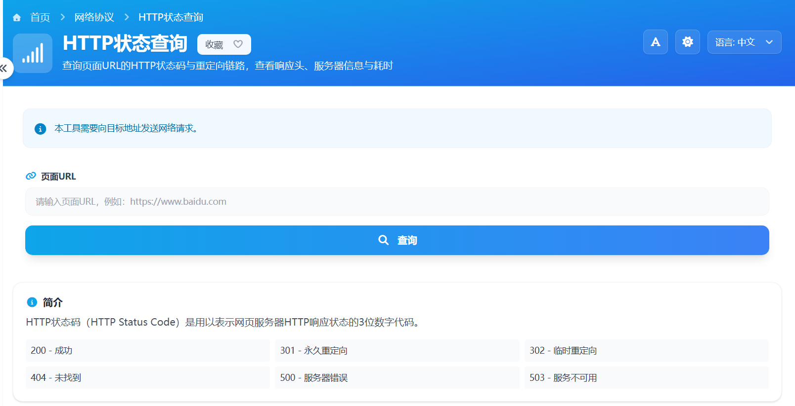

# HTTP状态查询 在线工具分享

平时遇到网页打不开、链接跳来跳去、页面突然报错，很多人第一反应是不知道问题出在哪。其实这类情况，先查一下网址返回的 HTTP 状态码，往往就能快速判断大概原因。

所以我用 Vue 开发了一个「HTTP状态查询」在线工具，不用安装软件，打开网页输入网址就能查，适合普通用户做日常排查。

> 在线工具网址：[https://see-tool.com/http-status-query](https://see-tool.com/http-status-query)  
> 工具截图：  
> 

这个工具可以帮你看这些内容：

- 当前网址返回的是 200、301、302、404 还是 500
- 页面有没有发生跳转，以及跳到了哪里
- 服务器返回了哪些响应头信息
- 页面响应大概花了多久

它适合这些场景：

- 网站打不开时，先看是不是 404、500 这类错误
- 链接推广前，检查有没有多次跳转
- 做网站内容更新后，确认页面是否正常返回
- 普通用户遇到访问异常时，先做第一步自查

使用方法很简单：

1. 打开 HTTP状态查询 工具页面
2. 输入要检测的网址
3. 点击查询按钮
4. 查看状态码、跳转链路和响应头结果

比如看到 200，一般说明页面能正常访问；看到 301 或 302，说明网址发生了跳转；如果是 404，通常代表页面不存在；如果是 500，通常是服务器端出现了问题。

我在做这个工具时，重点就是尽量让结果看得明白。即使不懂技术，也能通过状态码和跳转结果，快速知道“是网址错了、页面被跳转了，还是网站本身出了问题”。

如果你平时会发链接、管网站，或者只是想知道一个网页为什么打不开，这个工具会比较实用。
