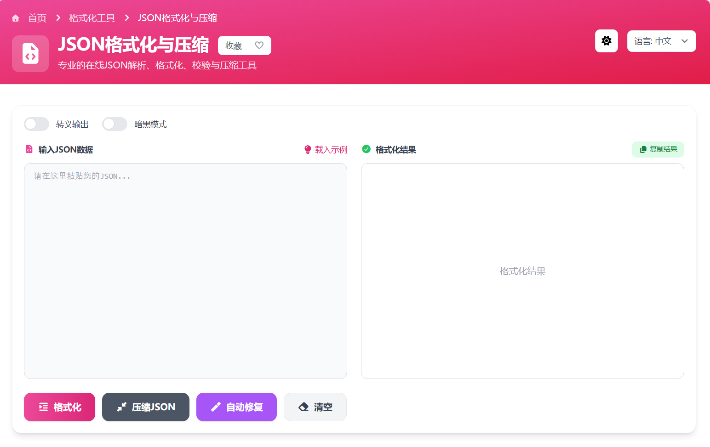

# JSON格式化工具技术实现详解

本文深入解析本项目中JSON格式化工具的前端实现，涵盖核心算法（Composable）与界面交互（Vue）。


> 在线工具网址：[https://see-tool.com/encoding-converter](https://see-tool.com/encoding-converter)

> 工具截图：
> 


## 一、核心逻辑 (Composable Implementation)

业务逻辑封装在 `useJsonFormatter` 中，实现纯函数的逻辑复用。

### 1. 格式化 (Format)
利用 `JSON.stringify` 的第三个参数控制缩进。
```javascript
const formatJson = (input, escape = false) => {
    let formatted = JSON.stringify(JSON.parse(input), null, 2);
    // 二次序列化实现转义：JSON.stringify(str).slice(1, -1)
    return escape ? JSON.stringify(formatted).slice(1, -1) : formatted;
};
```

### 2. 压缩 (Minify)
去除 `space` 参数即可移除空白。
```javascript
const minifyJson = (input) => JSON.stringify(JSON.parse(input));
```

### 3. 自动修复 (Auto Fix)
针对非标准JSON（如有损粘贴），采用“正则替换 + JS执行”的双重降级策略。
1. **正则预处理**：替换单引号、移除尾随逗号、给Key加引号。
2. **兜底解析**：若 `JSON.parse` 失败，使用 `new Function` 解析JS对象字面量（如 `{a:1}`）。

---

## 二、界面交互 (Vue Page Implementation)

UI层主要处理状态管理、实时反馈与性能优化。

### 1. 防抖实时预览
为了提供流畅体验，输入框绑定了防抖（Debounce）监听器。用户停止输入500ms后自动触发静默格式化。

```javascript
// watch debounce 实现
let timer = null;
watch([jsonInput, escapeOutput], () => {
    if(timer) clearTimeout(timer);
    timer = setTimeout(() => {
        if(jsonInput.value.trim()) {
            handleFormat(true); // true 表示静默模式，不弹出的Toast提示
        }
    }, 500);
})
```

### 2. 高亮库的动态加载 (Performance)
`highlight.js` 体积较大，仅在客户端挂载时动态引入，避免阻塞服务端渲染（SSR）首屏。

```javascript
onMounted(async () => {
    if (!process.client) return;
    
    // 动态创建 script 标签加载 CDN 资源
    // 优先复用 window.hljs 避免重复加载
    await loadHighlightLibrary(); 
    
    // 初始化高亮
    highlight.highlightElement(codeRef.value);
});
```

### 3. 输入容错与反馈
UI通过 `inputError` 状态即时展示解析错误位置，配合红色警告框，提升调试效率。

```javascript
try {
    const res = formatJson(input);
    jsonOutput.value = res;
    inputError.value = '';
} catch (e) {
    // 捕获 JSON.parse 的错误信息直接展示
    inputError.value = e.message; 
}
```
