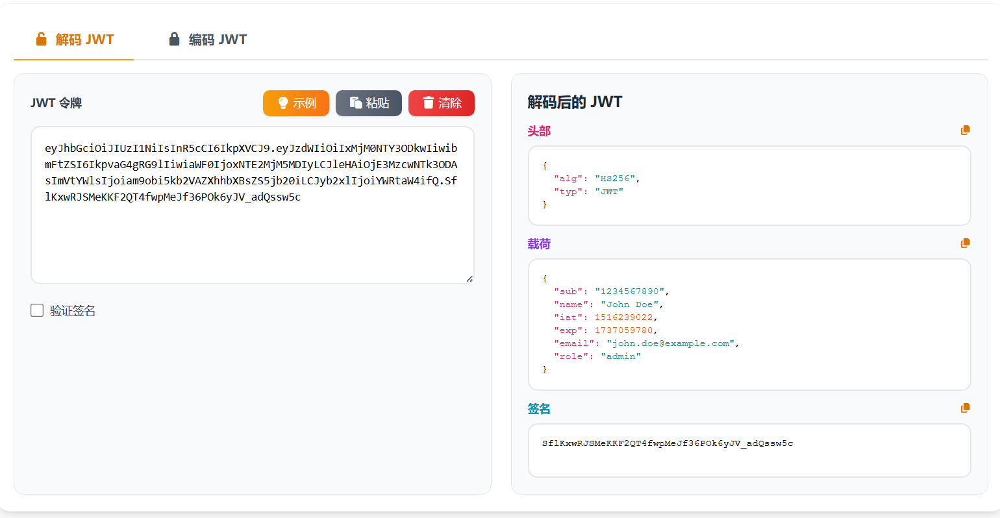

# JWT编码/解码核心JS实现

本文将介绍基于 Vue 3 和 Nuxt 3 实现的"JWT编码/解码"工具的核心技术方案。该工具主要用于在浏览器端对 JWT（JSON Web Token）进行编码、解码和签名验证，所有处理均在前端完成。

> 在线工具网址：[https://see-tool.com/jwt-encryptor](https://see-tool.com/jwt-encryptor)  
> 工具截图：  
> 

## 1. 核心库设计

我们将核心的 JWT 处理逻辑封装在一个独立的 JS 库中，采用 IIFE 模式导出到全局 `window.JWTHelper`。

### 1.1 Base64 URL 编码/解码

JWT 使用 Base64 URL 安全编码，需要将标准 Base64 的 `+` 替换为 `-`，`/` 替换为 `_`，并移除填充字符 `=`。

```javascript
base64UrlEncode(str) {
    const base64 = CryptoJS.enc.Base64.stringify(CryptoJS.enc.Utf8.parse(str));
    return base64
        .replace(/\+/g, '-')
        .replace(/\//g, '_')
        .replace(/=/g, '');
}

base64UrlDecode(str) {
    let base64 = str.replace(/-/g, '+').replace(/_/g, '/');
    while (base64.length % 4) {
        base64 += '=';
    }
    
    try {
        return CryptoJS.enc.Base64.parse(base64).toString(CryptoJS.enc.Utf8);
    } catch (error) {
        throw new Error('Invalid Base64 URL encoding');
    }
}
```

### 1.2 JWT 解码

将 JWT token 按点号分割成三部分，分别解码 Header、Payload 和 Signature。

```javascript
decode(token) {
    if (!token || typeof token !== 'string') {
        throw new Error('Invalid token');
    }

    const parts = token.split('.');
    if (parts.length !== 3) {
        throw new Error('Invalid JWT format. Expected 3 parts separated by dots');
    }

    try {
        const header = JSON.parse(this.base64UrlDecode(parts[0]));
        const payload = JSON.parse(this.base64UrlDecode(parts[1]));
        const signature = parts[2];

        return {
            header,
            payload,
            signature
        };
    } catch (error) {
        throw new Error('Failed to decode JWT: ' + error.message);
    }
}
```

### 1.3 签名创建

支持多种算法：HMAC（HS256/384/512）、RSA PKCS#1 v1.5（RS256/384/512）、RSA-PSS（PS256/384/512）、ECDSA（ES256/384/512）。

```javascript
createSignature(header, payload, secret, algorithm = 'HS256') {
    const data = header + '.' + payload;
    const alg = algorithm.toUpperCase();

    if (alg.startsWith('HS')) {
        let hash;
        switch (alg) {
            case 'HS256':
                hash = CryptoJS.HmacSHA256(data, secret);
                break;
            case 'HS384':
                hash = CryptoJS.HmacSHA384(data, secret);
                break;
            case 'HS512':
                hash = CryptoJS.HmacSHA512(data, secret);
                break;
            default:
                throw new Error('Unsupported HMAC algorithm: ' + algorithm);
        }
        return CryptoJS.enc.Base64.stringify(hash)
            .replace(/\+/g, '-')
            .replace(/\//g, '_')
            .replace(/=/g, '');
    }

    if (alg.startsWith('RS')) {
        return this.createRSASignature(data, secret, alg);
    }

    if (alg.startsWith('PS')) {
        return this.createPSSSignature(data, secret, alg);
    }

    if (alg.startsWith('ES')) {
        return this.createECDSASignature(data, secret, alg);
    }

    throw new Error('Unsupported algorithm: ' + algorithm);
}
```

### 1.4 RSA 签名实现

使用 Web Crypto API 处理非对称加密算法，先将 PEM 格式的私钥导入，然后进行签名。

```javascript
async createRSASignature(data, privateKeyPem, algorithm) {
    try {
        const privateKey = await this.importRSAPrivateKey(privateKeyPem);
        
        let hashAlg;
        switch (algorithm) {
            case 'RS256':
                hashAlg = 'SHA-256';
                break;
            case 'RS384':
                hashAlg = 'SHA-384';
                break;
            case 'RS512':
                hashAlg = 'SHA-512';
                break;
            default:
                throw new Error('Unsupported RSA algorithm: ' + algorithm);
        }

        const encoder = new TextEncoder();
        const dataBuffer = encoder.encode(data);
        const signatureBuffer = await crypto.subtle.sign(
            {
                name: 'RSASSA-PKCS1-v1_5',
                hash: { name: hashAlg }
            },
            privateKey,
            dataBuffer
        );

        const signatureArray = new Uint8Array(signatureBuffer);
        const signatureBase64 = btoa(String.fromCharCode.apply(null, signatureArray));
        return signatureBase64
            .replace(/\+/g, '-')
            .replace(/\//g, '_')
            .replace(/=/g, '');
    } catch (error) {
        throw new Error('RSA signature failed: ' + error.message);
    }
}
```

### 1.5 密钥导入

将 PEM 格式的密钥转换为 Web Crypto API 可用的 CryptoKey 对象。

```javascript
async importRSAPrivateKey(pem) {
    const pemContents = pem
        .replace(/-----BEGIN (RSA )?PRIVATE KEY-----/, '')
        .replace(/-----END (RSA )?PRIVATE KEY-----/, '')
        .replace(/\s/g, '');
    
    const binaryDer = atob(pemContents);
    const binaryDerBuffer = new Uint8Array(binaryDer.length);
    for (let i = 0; i < binaryDer.length; i++) {
        binaryDerBuffer[i] = binaryDer.charCodeAt(i);
    }

    return await crypto.subtle.importKey(
        'pkcs8',
        binaryDerBuffer,
        {
            name: 'RSASSA-PKCS1-v1_5',
            hash: { name: 'SHA-256' }
        },
        false,
        ['sign']
    );
}
```

### 1.6 JWT 编码

将 Header、Payload 编码后创建签名，组合成完整的 JWT token。

```javascript
async encode(payload, secret, algorithm = 'HS256') {
    if (!secret) {
        throw new Error('Secret key is required');
    }

    if (typeof payload !== 'object' || payload === null) {
        throw new Error('Payload must be an object');
    }

    const header = {
        alg: algorithm.toUpperCase(),
        typ: 'JWT'
    };

    const encodedHeader = this.base64UrlEncode(JSON.stringify(header));
    const encodedPayload = this.base64UrlEncode(JSON.stringify(payload));

    const signature = await this.createSignature(encodedHeader, encodedPayload, secret, algorithm);

    return encodedHeader + '.' + encodedPayload + '.' + signature;
}
```

### 1.7 签名验证

验证 JWT 签名的有效性，支持所有算法类型。

```javascript
async verify(token, secret) {
    if (!token || !secret) {
        return false;
    }

    try {
        const parts = token.split('.');
        if (parts.length !== 3) {
            return false;
        }

        const header = JSON.parse(this.base64UrlDecode(parts[0]));
        const algorithm = header.alg;
        const data = parts[0] + '.' + parts[1];

        if (algorithm.startsWith('RS')) {
            return await this.verifyRSASignature(data, parts[2], secret, algorithm);
        }

        if (algorithm.startsWith('PS')) {
            return await this.verifyPSSSignature(data, parts[2], secret, algorithm);
        }

        if (algorithm.startsWith('ES')) {
            return await this.verifyECDSASignature(data, parts[2], secret, algorithm);
        }

        const expectedSignature = this.createSignature(parts[0], parts[1], secret, algorithm);
        return parts[2] === expectedSignature;
    } catch (error) {
        console.error('Verification error:', error);
        return false;
    }
}
```

## 2. Vue 组件集成

在 Vue 组件中，通过动态脚本加载核心库和 crypto-js，然后使用 `window.JWTHelper` 进行编码和解码操作。

```javascript
const decodeJWT = async () => {
    const token = jwtInput.value.trim()
    if (!token) {
        headerOutput.value = ''
        payloadOutput.value = ''
        signatureOutput.value = ''
        signatureStatus.value = ''
        return
    }
    try {
        const decoded = jwtHelper.decode(token)
        headerOutput.value = formatJSON(decoded.header)
        payloadOutput.value = formatJSON(decoded.payload)
        signatureOutput.value = decoded.signature
        
        if (verifySignature.value && secretKey.value) {
            const isValid = await jwtHelper.verify(token, secretKey.value)
            signatureStatus.value = isValid ? 'valid' : 'invalid'
        } else {
            signatureStatus.value = ''
        }
    } catch (error) {
        headerOutput.value = error.message
        payloadOutput.value = ''
        signatureOutput.value = ''
        signatureStatus.value = ''
    }
}

const encodeJWT = async () => {
    try {
        const payload = JSON.parse(payloadInput.value || '{}')
        const token = await jwtHelper.encode(payload, secretKey.value, encodeAlgorithm.value)
        jwtOutput.value = token
    } catch (error) {
        jwtOutput.value = error.message
    }
}
```

## 总结

该方案的核心在于通过 `jwt-helper.js` 封装纯粹的 JWT 处理逻辑，结合 CryptoJS 处理 HMAC 算法，利用 Web Crypto API 处理非对称加密算法（RSA、ECDSA），实现了一个功能完善的纯前端 JWT 编码/解码工具。
