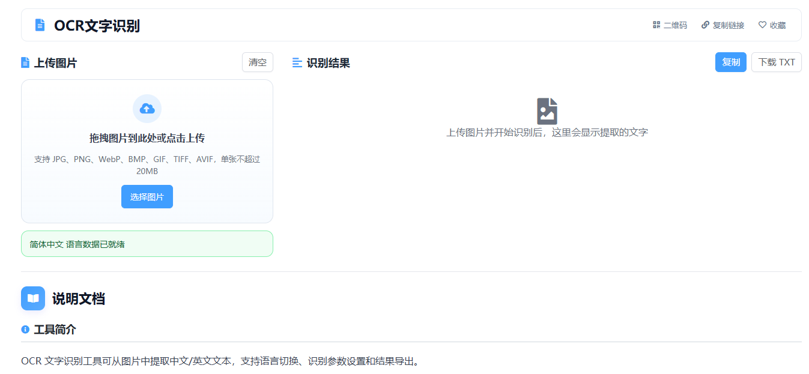

# 基于 Tesseract.js 的OCR文字识别工具核心JS实现

这篇文章只讲本项目里“OCR文字识别”工具的功能 JS 实现。页面层用 Vue 负责挂载和交互，真正的识别链路由前端脚本完成：上传图片、可选预处理、创建 OCR worker、执行识别、输出文本结果。

> 在线工具网址：[https://see-tool.com/ocr-text-recognition](https://see-tool.com/ocr-text-recognition)  
> 工具截图：  
> 

核心流程可以概括成一条线：

`选择图片 -> 读取为 DataURL -> 可选 Canvas 预处理 -> 创建 Tesseract Worker -> 识别文字 -> 输出文本与统计信息`

## 1）先把功能状态集中到一个对象里

这个工具不是简单的“上传后立即识别”，它还要处理语言切换、识别进度、结果复制、结果下载和 worker 生命周期，所以一开始就把核心状态收拢到了 `state` 里。

这里最关键的几项是：

- `imageDataUrl`：当前待识别图片
- `selectedLanguage`：当前语言
- `isProcessing`：是否正在识别
- `activeWorker`：当前识别任务对应的 worker
- `preloadedLanguages`：已经预加载过的语言
- `preloadTasks`：正在进行中的语言加载任务

这样做的好处是，上传、识别、切换语言、清空结果这些动作都能围绕同一份状态工作，不容易出现界面和内部状态不一致的问题。

## 2）上传入口统一走图片校验和 DataURL 读取

工具同时支持点击上传和拖拽上传，但最终都会进入同一套处理函数。文件进来后先判断是不是图片，再检查大小，符合条件才继续读取。

读取方式用的是 `FileReader.readAsDataURL`。这么做有两个直接好处：

1. 可以立即把图片展示到预览区
2. 后续 OCR 和预处理都可以直接复用这份 DataURL

上传成功后，工具会同步重置旧结果，避免新图片沿用上一次的识别文本。

## 3）预处理不是独立服务，而是前端 Canvas 直接完成

这个工具提供了一个可选预处理开关，目的很明确：在识别前先把图片转换成更适合 OCR 的形式。

实现方式是把图片绘制到 `canvas`，取出像素数据后做两步处理：

1. 按 RGB 权重转成灰度值
2. 依据阈值做黑白二值化

处理完成后，再导出成新的 PNG DataURL 交给 OCR 引擎。这样可以让识别阶段拿到更干净的图像数据，尤其适合文字和背景对比比较明显的场景。

## 4）OCR 引擎的关键是 Worker 化

识别引擎基于 `Tesseract.createWorker`。每次创建 worker 时，会同时指定三类资源：

- worker 脚本
- wasm 核心
- 语言数据

这一步的意义不是“把库跑起来”这么简单，而是把识别工作放到独立线程里执行，避免主线程在 OCR 过程中完全卡住。页面上还能继续更新进度、按钮状态和提示信息。

工具没有把所有语言一次性全部初始化，而是按当前所选语言创建 worker，这样功能逻辑更清晰，也更符合实际使用路径。

## 5）语言预加载解决的是“首次识别前的等待感”

OCR 工具和普通文本工具不一样，第一次识别前通常要先准备语言数据。如果每次点击“开始识别”才从头加载，交互会显得很钝。

所以这里单独做了 `preloadLanguage`。它负责三件事：

1. 判断目标语言是否已经加载过
2. 判断该语言是否已经有一个加载任务在进行中
3. 创建临时 worker 完成语言准备，结束后立即释放

其中 `preloadedLanguages` 用来记忆“这个语言已经准备好”，`preloadTasks` 用来避免同一种语言被重复并发加载。这样切换语言时可以提前准备，真正开始识别时就不会重复走整套加载流程。

## 6）识别主流程围绕一次任务展开

真正点击识别后，主流程会按顺序做这些事：

1. 检查当前是否有图片、是否正在处理中
2. 更新处理状态和进度提示
3. 确保所选语言已经预加载完成
4. 读取分段模式设置
5. 根据开关决定是否先做图片预处理
6. 创建本次任务使用的 worker
7. 通过 `setParameters` 写入 `tessedit_pageseg_mode`
8. 调用 `recognize` 开始识别
9. 提取返回结果里的文本和置信度
10. 计算耗时并更新结果区

这里比较关键的一点是：识别用的 worker 和预加载用的 worker 是分开的。预加载只负责把语言资源准备好，正式识别时再创建当前任务自己的 worker。这样任务边界更清楚，结束时也更容易完整释放。

## 7）进度条不是本地估算，而是跟着 Tesseract 的 logger 走

工具里的进度展示并不是写死几个延时动画，而是直接读取 Tesseract logger 回调里的状态。

实现里会根据不同阶段的状态文本更新进度，例如：

- 加载核心
- 初始化引擎
- 加载语言数据
- 准备 API
- 正在识别文字

前几个阶段使用固定百分比区间，进入 `recognizing text` 后，再根据回调里的 `progress` 动态推进到 100%。这样用户看到的不是“假进度”，而是和识别过程同步的真实状态。

## 8）结果区不只展示文本，还会同步生成统计信息

识别成功后，工具不会只把文本塞进文本框里就结束，而是立刻补齐几项结果信息：

- 识别文本
- 置信度
- 耗时
- 字符数
- 行数
- 当前语言名称

其中字符数和行数来自结果文本本身：字符数直接取长度，行数则按换行拆分并过滤空白行。这样结果区既能作为复制出口，也能给用户一个快速判断识别质量的依据。

## 9）复制和下载都围绕结果文本本身展开

识别结果出来后，工具提供两个常用动作：复制和下载。

复制优先走 `navigator.clipboard.writeText`，如果浏览器环境不支持，再退回到隐藏 `textarea` 加 `execCommand('copy')` 的兼容写法。下载则是把文本内容包装成 `Blob`，再生成对象 URL 触发保存。

这两个动作都不依赖额外服务，结果一旦识别完成，就可以立刻在浏览器侧完成后续处理。

## 10）这套核心 JS 的重点，其实是“任务生命周期完整”

这个 OCR 工具的关键不只是把图片送进识别引擎，而是把一次识别任务从开始到结束完整串起来：图片读取、语言预热、预处理、识别、进度反馈、结果统计、复制下载、worker 释放。

从功能 JS 的角度看，它本质上是一条比较清晰的前端任务流水线，而 Vue 在这里主要负责承接交互和挂载，让整套 OCR 功能可以稳定地运行在页面里。
