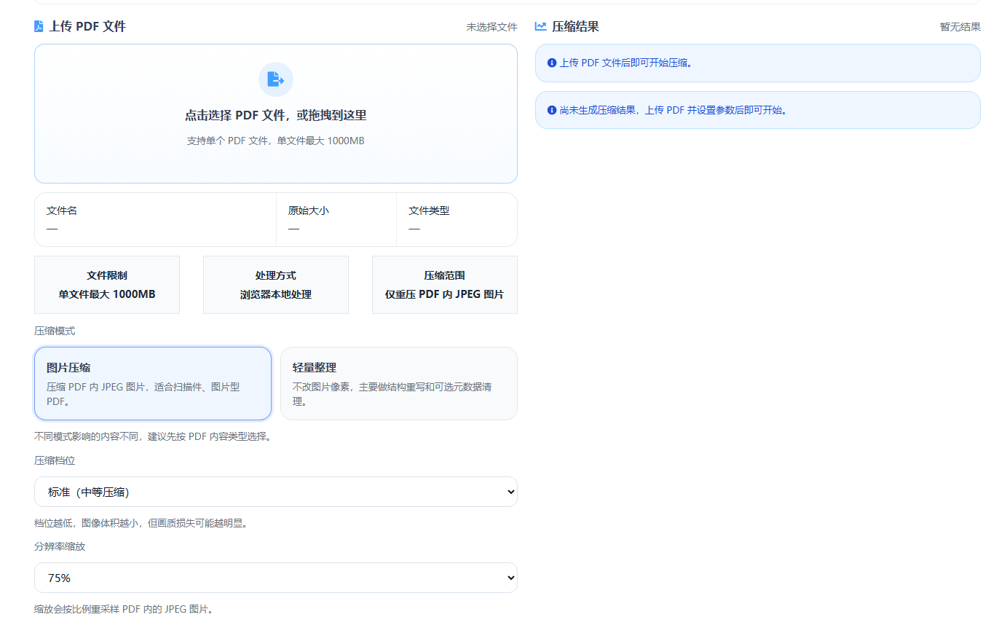

# 在线PDF压缩工具分享

很多人都会碰到 PDF 太大的情况，比如简历投递传不上去、邮箱附件超限、报名材料无法提交，或者手机拍出来的扫描件体积太大。为了让普通用户也能更轻松地处理这些问题，我做了一个在线 PDF 压缩工具。

这个工具是我用 Vue 开发的，打开网页就能直接使用，不需要安装额外软件。对日常办公、学习资料整理、发票合同提交这些场景来说，会比较方便。

> 在线工具网址：[https://see-tool.com/pdf-compress](https://see-tool.com/pdf-compress)  
> 工具截图：  
> 

## 这个工具能做什么

- 压缩 PDF 文件体积
- 适合处理扫描件、合同、发票、作业等常见文件
- 操作简单，普通用户也能快速上手
- 压缩后可直接下载结果

## 怎么使用

1. 打开在线 PDF 压缩工具页面。
2. 上传需要压缩的 PDF 文件。
3. 选择合适的压缩方式或压缩强度。
4. 等待处理完成后下载压缩后的文件。

整个流程比较直观，不需要专业知识。对于只想把文件变小、尽快提交资料的用户来说，这种在线工具比安装桌面软件省事很多。

## 适合哪些场景

- 简历和附件上传
- 邮箱发送 PDF 文件
- 报名材料、申请资料提交
- 合同、发票、扫描件瘦身整理

如果你经常遇到 PDF 太大传不上去的问题，这个工具会很实用。它是我基于 Vue 做的一个轻量在线工具，目标很简单，就是让普通用户也能快速完成 PDF 压缩。
