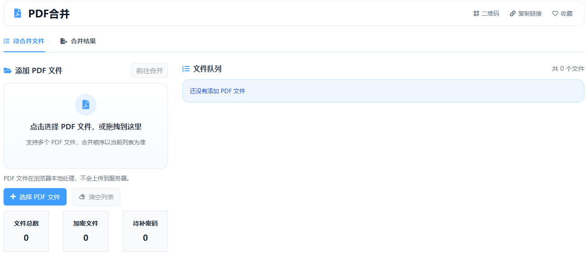

# 在线PDF合并工具分享

日常办公里，很多人都会遇到这样的情况：合同分成了几个 PDF，扫描件一页一页保存，或者报名、报销、资料提交时需要把多个文件整理成一个。为了少装软件、少折腾格式，我做了一个在线 PDF 合并工具。

这个工具是我用 Vue 开发的，打开网页就能直接使用，适合普通用户快速处理 PDF。它的重点不是复杂功能，而是让合并这件事更简单。

> 在线工具网址：[https://see-tool.com/pdf-merge](https://see-tool.com/pdf-merge)  
> 工具截图：  
> 

## 这个工具能做什么

- 把多个 PDF 合并成一个文件
- 支持调整文件顺序
- 合并完成后直接下载结果
- 本地处理更方便，适合整理合同、发票、作业、申请材料

## 怎么用

1. 打开工具页面，选择多个需要合并的 PDF 文件。
2. 按你的需要调整文件前后顺序。
3. 点击合并，等待生成新的 PDF。
4. 下载合并后的文件，保存到本地即可。

整个流程很直观，基本不需要学习成本。对普通用户来说，最实用的地方就是省时间，不用再为了合并 PDF 专门安装桌面软件。

## 适合哪些场景

- 合同、报价单、说明书整理成一个文件
- 发票、票据、扫描件统一归档
- 报名材料、简历附件、申请资料一次性提交
- 把零散 PDF 合成一个更方便发送的版本

如果你刚好经常处理 PDF，这个在线工具会比较实用。它是我基于 Vue 做的一个轻量工具，目标就是让普通用户也能快速完成 PDF 合并，不绕弯，打开就能用。
