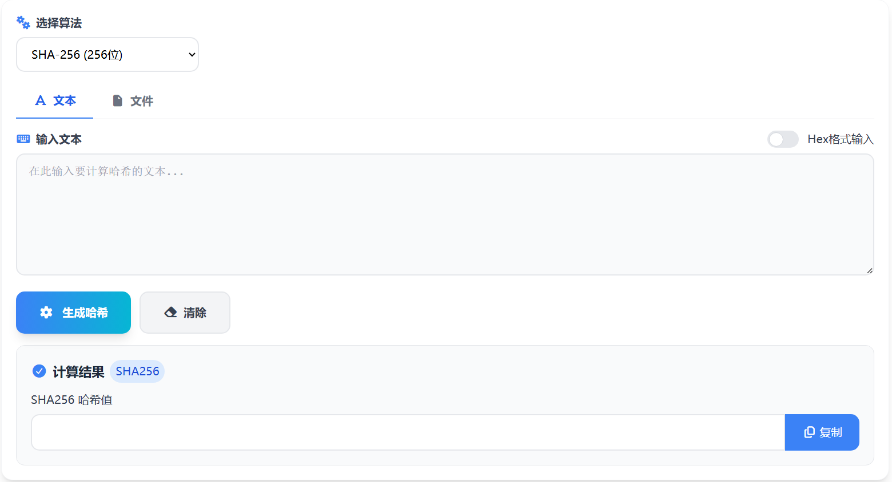

# SHA在线加密 核心JS实现

这篇文章聚焦本项目中 SHA 在线加密工具的核心 JS 实现思路，强调数据在浏览器端完成计算的流程组织与结果生成方式。

> 在线工具网址：[https://see-tool.com/sha-encryptor](https://see-tool.com/sha-encryptor)  
> 工具截图：  
> 

## 核心思路

工具的本质是把输入文本稳定地映射为固定长度的摘要。实现上以浏览器原生加密能力为核心，通过统一的数据编码、哈希计算与结果格式化，保证输出一致且可复现。

## 数据流

输入内容变化时触发计算流程。文本先被规范为字符串，再通过编码器转换为字节序列，避免不同环境的字符编码差异造成结果不一致。这个字节序列是哈希算法的直接输入。

## 哈希计算

核心计算使用 Web Crypto API 的摘要能力，算法类型作为参数传入，返回二进制缓冲区。该过程是异步的，计算完成后再进入结果处理阶段。整个流程可被封装为一个纯函数式的异步方法，便于在响应式场景中复用。

## 结果格式化

摘要结果需要从二进制转换为十六进制字符串，便于展示与复制。常见做法是遍历字节数组，将每个字节转换为两位十六进制并拼接成最终字符串，确保长度稳定且前导零不丢失。

## 代码结构

实现可以拆为四层：输入规范化、字节编码、摘要计算、结果格式化。每一层都保持纯函数，便于组合和测试，也让响应式框架更容易驱动结果更新。

## 核心计算

下面是 SHA 计算的核心 JS 代码，包含算法校验、文本编码、摘要计算与十六进制输出。默认使用 SHA-256，也可以通过参数切换其他 SHA 算法。

```js
const supportedAlgorithms = new Set(['SHA-1', 'SHA-256', 'SHA-384', 'SHA-512'])

const normalizeInput = (value) => {
  if (typeof value === 'string') return value
  if (value === null || value === undefined) return ''
  return String(value)
}

const encodeText = (text) => {
  return new TextEncoder().encode(text)
}

const toHex = (buffer) => {
  const bytes = new Uint8Array(buffer)
  let result = ''
  for (const byte of bytes) {
    result += byte.toString(16).padStart(2, '0')
  }
  return result
}

const shaHex = async (text, algorithm = 'SHA-256') => {
  const normalized = normalizeInput(text)
  if (!normalized) return ''
  if (!supportedAlgorithms.has(algorithm)) {
    throw new Error('不支持的算法类型')
  }
  const data = encodeText(normalized)
  const hashBuffer = await crypto.subtle.digest(algorithm, data)
  return toHex(hashBuffer)
}
```

## 并发处理

用户输入频繁变化时，异步计算可能出现结果乱序。可以用递增序号的方式只保留最新一次结果，保证界面始终显示最新输入的哈希值。

```js
const createShaRunner = () => {
  let taskId = 0
  return async (text, algorithm, onResult) => {
    const currentId = ++taskId
    try {
      const hash = await shaHex(text, algorithm)
      if (currentId !== taskId) return
      onResult({ hash, error: '' })
    } catch (error) {
      if (currentId !== taskId) return
      onResult({ hash: '', error: error?.message || '计算失败' })
    }
  }
}
```

## 状态驱动

把输入、算法选择、结果状态拆成独立状态即可形成清晰的数据闭环。输入或算法变化时触发计算，输出只由最新一次计算决定。

```js
import { ref, watch } from 'vue'

const inputText = ref('')
const algorithm = ref('SHA-256')
const outputHash = ref('')
const errorText = ref('')

const runSha = createShaRunner()

const compute = async () => {
  await runSha(inputText.value, algorithm.value, ({ hash, error }) => {
    outputHash.value = hash
    errorText.value = error
  })
}

watch([inputText, algorithm], compute, { immediate: true })
```
