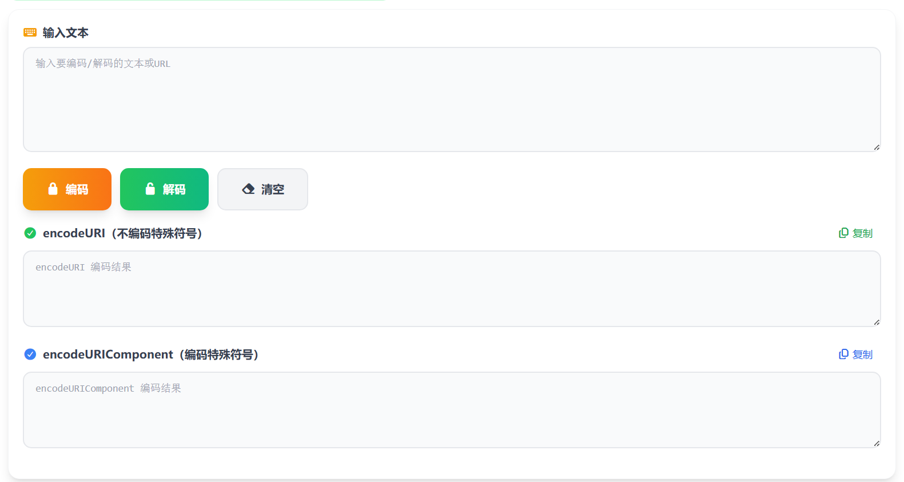

# URL编码/解码 在线工具分享

平时在网上冲浪，有时候会碰到链接里有一堆奇怪的 %20、%3A 这样的符号，其实这就是 URL 编码后的结果。

最近我用 Vue 开发了一个 URL 编码/解码的在线小工具，用起来挺顺手的，分享给大家。

> 在线工具网址：[https://see-tool.com/url-encode-decode](https://see-tool.com/url-encode-decode)  
> 工具截图：  
> 

这个工具支持两种编码方式：encodeURI 和 encodeURIComponent，你可以根据需要选择。操作特别简单，把要处理的文字或链接粘贴进去，点一下编码或解码按钮，结果立刻就出来了。每个结果旁边都有复制按钮，一键就能复制到剪贴板，非常方便。

不管你是要把中文转换成 URL 安全的格式，还是要把那些看不懂的编码还原成原文，这个工具都能搞定。界面清爽，没有广告，用起来很舒服。

页面上还有详细的使用说明和常见字符编码对照表，即使你对 URL 编码不太了解，也能快速上手。

有需要的朋友可以试试看，希望能帮到你！
