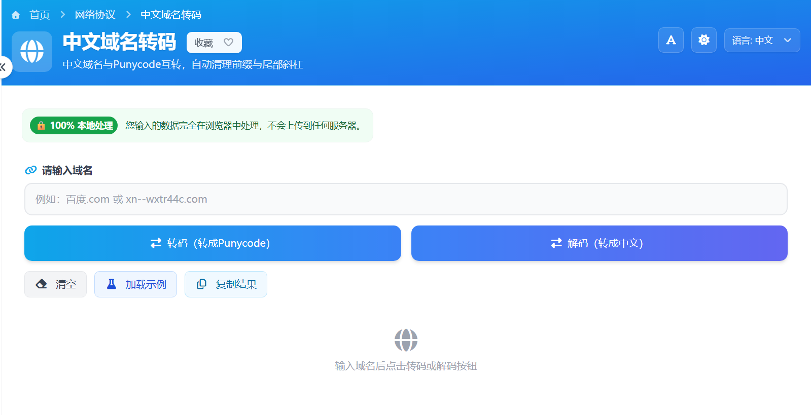

# 中文域名转码 在线工具核心JS实现

这个中文域名转码工具的核心功能并不复杂，重点是把“输入清洗、编码转换、解码转换、结果反馈”这几件事串成一个顺手的流程。整个交互是我用 **Vue** 做的，实际 JS 逻辑主要围绕几个小函数展开。

> 在线工具网址：[https://see-tool.com/chinese-domain-converter](https://see-tool.com/chinese-domain-converter)  
> 工具截图：  
> 

## 一、先统一处理用户输入

普通用户输入的内容往往不干净，可能直接粘贴完整网址，也可能带有 `http://`、`https://`、`www.`、路径参数，甚至末尾还有 `/`。如果不先清理，后面的 Punycode 转换结果就容易出错。

核心做法是先写一个标准化函数：

```javascript
const normalizeDomain = (input) => {
  let domain = String(input || '').trim()
  if (!domain) return ''

  domain = domain.replace(/\s+/g, '')
  domain = domain.replace(/^https?:\/\//i, '')
  domain = domain.replace(/^www\./i, '')
  domain = domain.split(/[/?#]/)[0]
  domain = domain.replace(/\/+$/, '')

  return domain
}
```

这段逻辑解决了几个实际问题：

- 去掉首尾空白和中间空格
- 自动剥离协议头
- 去掉常见的 `www.` 前缀
- 截断路径、查询参数、哈希片段
- 清理结尾多余斜杠

这样不管用户输入的是 `https://www.中文.com/test?a=1`，还是直接输入 `xn--fiq228c.com`，后续函数拿到的都是可直接转换的域名主体。

## 二、编码与解码函数保持极简

工具本身依赖 `punycode` 完成核心转换，因此在项目里需要先安装这个包：

```bash
npm install punycode
```

安装完成后，在 JS 里引入即可使用：

```javascript
import punycode from 'punycode/punycode.js'
```

有了这个依赖后，业务层只需要做很薄的一层封装：

```javascript
const encodeDomain = (input) => {
  const domain = normalizeDomain(input)
  if (!domain) return ''
  return punycode.toASCII(domain)
}

const decodeDomain = (input) => {
  const domain = normalizeDomain(input)
  if (!domain) return ''
  return punycode.toUnicode(domain)
}
```

这里的思路很直接：

- 编码时调用 `toASCII`，把中文域名转成 `xn--` 格式
- 解码时调用 `toUnicode`，把 Punycode 还原成中文域名
- 两边都先走一遍标准化流程，避免重复写输入校验

这种拆分方式的好处是，转换逻辑本身非常纯粹，页面按钮、输入框、复制结果这些交互都不用关心底层细节。

## 三、Vue 页面只负责驱动流程

页面层主要维护 3 个响应式状态：输入内容、结果文案、结果标签。这样点击“编码”或“解码”时，只需要更新对应状态，界面就会自动刷新。

```javascript
const domainInput = ref('')
const resultText = ref('')
const resultLabel = ref('')

const showResult = (label, text) => {
  resultLabel.value = label
  resultText.value = text
}
```

在实际按钮事件里，流程也很清楚：先取输入值，做空判断，再执行转换，最后把结果写回页面。

```javascript
const handleEncode = () => {
  const normalized = normalizeDomain(domainInput.value)
  if (!normalized) return

  showResult('编码结果', encodeDomain(normalized))
}

const handleDecode = () => {
  const normalized = normalizeDomain(domainInput.value)
  if (!normalized) return

  showResult('解码结果', decodeDomain(normalized))
}
```

这里有两个细节值得注意：

- 事件函数先判断空输入，避免无意义调用
- 展示结果统一走 `showResult`，减少重复赋值代码

## 四、补齐清空、示例、复制这些辅助功能

一个在线工具是否顺手，不只看“能不能转”，还要看辅助操作是否完整。

清空逻辑很简单，本质上就是把输入和结果都重置：

```javascript
const clearAll = () => {
  domainInput.value = ''
  resultText.value = ''
  resultLabel.value = ''
}
```

示例功能则是直接写入一个默认中文域名，再触发一次编码，这样用户打开页面就能立即看到工具效果。

复制结果依赖浏览器剪贴板 API：

```javascript
const copyResult = async () => {
  if (!resultText.value) return
  await navigator.clipboard.writeText(resultText.value)
}
```

这个实现虽然短，但很实用。用户完成转码后可以直接复制到域名配置、后台录入或文档里，不需要再手动选中文本。

## 五、这类工具的核心其实是“少而准”

中文域名转码不需要很重的业务逻辑，关键是把输入处理做好，把编码解码函数拆清楚，再用 Vue 的响应式状态把页面联动起来。最终形成的就是一个很轻、但完成度很高的小工具：输入域名，点击按钮，立刻拿到结果。

从实现角度看，这个工具最核心的 JS 价值就是两点：一是把脏输入统一清洗，二是把 `punycode` 转换能力包装成稳定的页面交互流程。
