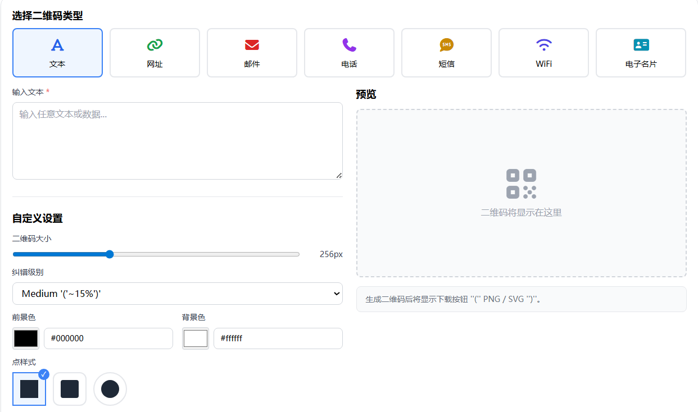

# 二维码生成器 在线工具分享

在日常工作和生活中，二维码几乎无处不在：加好友、分享网址、下载APP、展示收款码、打印宣传物料，都离不开它。为了让不懂技术的普通用户也能轻松生成高质量二维码，我做了一个「二维码生成器」在线小工具，打开浏览器就能用，无需安装任何软件。

这个工具是我用 Vue 技术栈开发的，前端框架选的是 Vue（基于 Nuxt 3），所有二维码的生成和渲染都在浏览器本地完成，不会把你的内容上传到服务器，更适合处理一些包含隐私信息的链接或文本。只要设备上有现代浏览器，无论是电脑还是手机，都可以直接访问使用。

> 在线工具网址：[https://see-tool.com/qr-code-generator](https://see-tool.com/qr-code-generator)
> 工具截图：
> 

## 工具使用流程

工具的使用流程非常简单：

1. 在输入框中粘贴或输入内容，可以是网址、文本、电话号码、邮件地址等；
2. 选择合适的二维码尺寸，分辨率越高，打印出来就越清晰；
3. 可按需调整容错等级，内容越重要、使用场景越复杂（比如线下物料、易污损环境），建议选择更高的容错级别；
4. 点击生成二维码按钮，页面会立即实时预览生成结果；
5. 支持一键下载图片，方便插入到文档、海报或发给朋友。

## 交互设计思路

在设计交互时，我更偏向「所见即所得」：当你修改内容或参数时，二维码会实时更新，不需要反复点击提交；颜色、背景等视觉样式也做了优化，在保证扫码成功率的前提下，尽量让二维码看起来更美观，适合展示和打印。

因为是基于 Vue 开发，这个二维码生成器后续也可以比较方便地扩展更多能力，例如批量生成二维码、导入表格一键生成多张图片、为特定平台（如小程序、下载页）预设常用模板等。如果你在使用过程中有新的需求或想法，也欢迎随时反馈给我，我会在后续版本中持续打磨这个小工具。

希望这个在线二维码生成器，能帮你更高效地把信息变成可以扫码直达的入口，让分享变得更简单。

