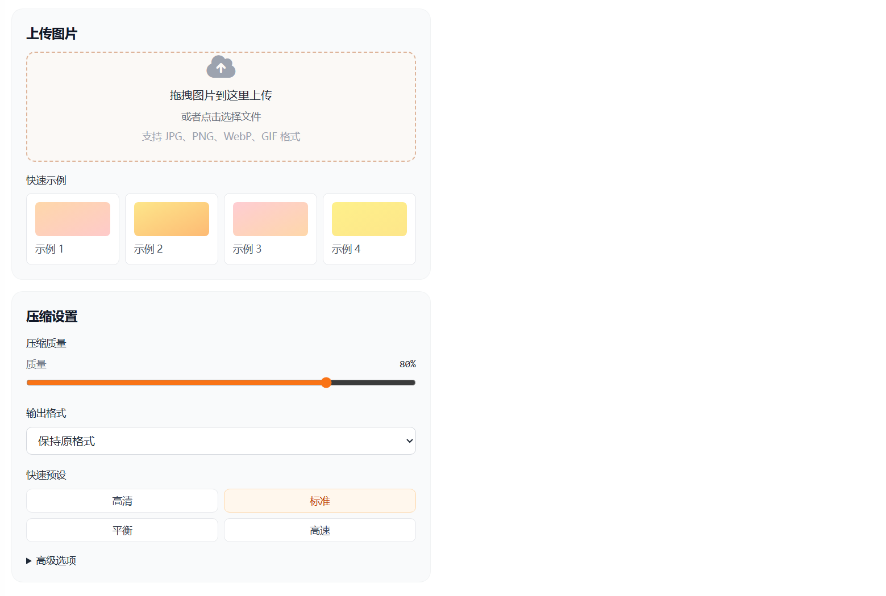

# 图片压缩在线工具分享

很多人都会遇到同一个问题：图片太大，上传失败；或者发到社交平台后加载很慢。为了解决这个高频需求，我做了一个图片压缩在线工具，打开网页就能用，不用安装软件。

这个工具面向普通用户设计，核心目标是“简单、直观、够用”。你只需要三步：上传图片、调整压缩参数、下载结果。常见的 JPG、PNG、WebP 都能处理，还支持批量压缩，适合整理相册、上传报名材料、优化电商商品图等场景。

> 在线工具网址：[https://see-tool.com/image-compressor](https://see-tool.com/image-compressor)  
> 工具截图：  
> 

## 怎么使用

1. 选择或拖拽图片到页面中。
2. 设置压缩质量或目标大小（按你的用途选：清晰优先或体积优先）。
3. 预览压缩前后效果，确认后下载。

如果你是发微信、邮件或表单上传，建议优先控制文件体积；如果是做展示图，建议先保证清晰度，再逐步降低体积。

## 这个工具有什么优势

- 操作门槛低，新手也能快速上手。
- 支持批量处理，省去反复压缩的时间。
- 压缩前后可对比，结果更可控。
- 页面响应快，适合日常高频使用。

另外，这个工具是我用 Vue 开发的。我在交互细节上做了不少优化，比如参数调整后的即时反馈、清晰的结果展示和更顺手的批量处理流程，目的是让非技术用户也能稳定完成图片压缩。

如果你经常需要上传图片，建议收藏这个工具，基本能覆盖日常 80% 以上的图片压缩需求。
