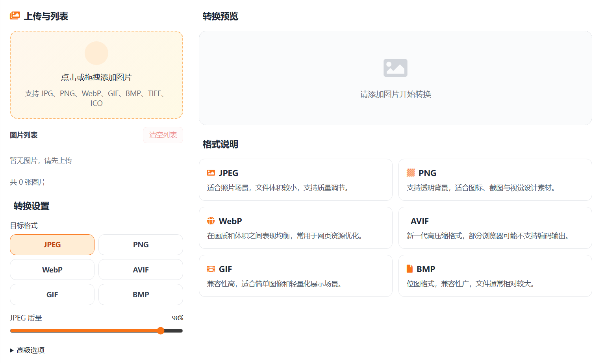

# 在线图片格式转换工具核心JS实现

图片格式转换看起来是一个简单按钮功能，但真正可用的在线工具，核心在于把“上传、参数、转换、回显、下载”串成一条稳定流程。本文只讲这个工具的功能 JS 设计与实现。

> 在线工具网址：[https://see-tool.com/image-format-converter](https://see-tool.com/image-format-converter)  
> 工具截图：  
> 

## 一、目标能力

工具提供三类核心能力：

- 多图上传与管理（拖拽、点选、删除、清空）
- 多格式转换（JPEG、PNG、WebP、AVIF、GIF、BMP）
- 转换后即时预览与下载（单张、批量）

整个实现分为两层：

- 前端负责交互编排与状态管理
- 后端负责真实编码转换与结果输出

## 二、前端核心流程

### 1）状态模型

前端维护一个统一状态对象：

- `images`：待处理图片列表
- `targetFormat`：当前目标格式
- `isConverting`：是否处于转换中

每张图片都会记录原始信息与转换信息，例如尺寸、体积、预览 URL、转换后 URL、输出扩展名等。这样可以在同一界面同时展示“原图”和“转换结果”。

### 2）上传接入

上传入口支持点击和拖拽。接入后会先过滤 `image/*` 类型，再读取每张图的基础信息：

```js
function readImageInfo(file) {
  return new Promise((resolve, reject) => {
    const url = URL.createObjectURL(file);
    const img = new Image();
    img.onload = () => resolve({
      url,
      width: img.naturalWidth || img.width,
      height: img.naturalHeight || img.height,
    });
    img.onerror = () => reject(new Error("image_load_failed"));
    img.src = url;
  });
}
```

这一步把后续转换需要的关键上下文（宽高、预览）一次性准备好。

### 3）参数组织

用户设置会转成统一请求参数：

- `format`：目标格式
- `quality`：质量（主要用于有损输出）
- `width` / `height`：可选缩放尺寸

前端使用 `FormData` 打包二进制文件与参数，直接发起转换请求。

### 4）转换执行

转换动作以“逐张 await”的方式执行，逻辑更直观，也方便把每张结果实时回写到列表：

```js
async function convertSingle(image) {
  const formData = new FormData();
  formData.append("image", image.file, image.name);
  formData.append("format", state.targetFormat);
  formData.append("quality", String(quality));

  const response = await fetch("/api/image-format-convert", {
    method: "POST",
    body: formData,
  });

  const blob = await response.blob();
  image.convertedUrl = URL.createObjectURL(blob);
  image.outputExt = response.headers.get("x-output-ext") || "jpg";
}
```

转换成功后，前端同时更新：

- 转换后预览地址
- 转换后体积和尺寸
- 输出扩展名与 MIME 信息

### 5）下载与清理

下载通过动态创建 `<a>` 标签触发浏览器保存。文件名支持自动附加后缀标识。图片被移除或列表清空时，会主动释放 `ObjectURL`，避免无效引用长期占用内存。

## 三、后端核心转换逻辑

### 1）表单解析与安全边界

后端首先解析 `multipart/form-data`，并设置边界条件：

- 文件大小上限
- 文件数量上限
- 字段数量上限

随后校验核心参数：格式是否合法、质量是否在范围内、宽高是否成对出现。

### 2）统一转换管线

图片转换基于 `sharp`：

- 读取输入并处理方向
- 按需缩放
- 根据目标格式分支输出编码参数

这部分本质是“同一输入管线 + 不同编码器参数”，结构清晰，便于扩展新格式。

### 3）BMP 特殊处理

BMP 不是直接复用常见编码分支，而是先输出原始像素，再用 `bmp-js` 编码。中间要做一次像素通道顺序调整（RGBA -> ABGR），保证结果可被标准 BMP 读取器正确识别。

### 4）响应协议

成功时返回二进制图片流，并携带辅助头信息：

- `Content-Type`：输出 MIME
- `X-Output-Ext`：输出扩展名
- `X-Output-Width` / `X-Output-Height`：输出尺寸
- `X-Output-Size`：输出体积

前端据此完成预览信息展示与下载命名。

## 四、实现要点小结

这个工具的核心 JS 并不复杂，关键在于把流程做完整：

- 前端：状态驱动上传、转换、回显、下载
- 后端：参数校验 + 统一转换 + 二进制输出
- 协议层：用响应头把“转换结果元信息”回传给前端

把这三层打通后，图片格式转换就从“能转”变成了“可持续使用的在线工具”。
