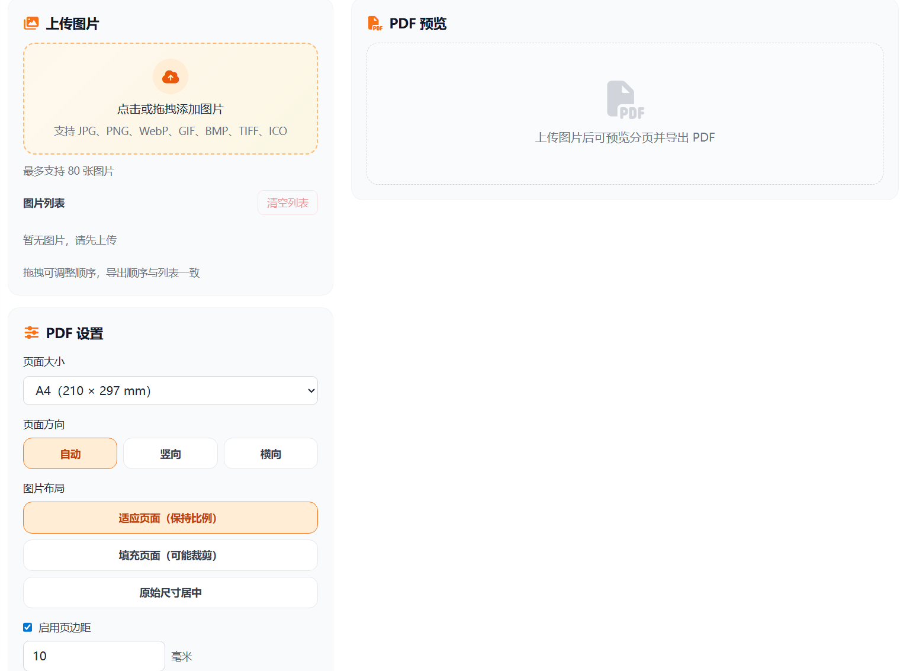

# 图片转PDF 在线工具分享

日常办公、学习和资料提交里，最常见的需求之一就是把图片整理成一个 PDF：比如作业拍照、合同截图、证件材料、报销凭证等。很多人会去找软件安装，其实更省事的方法是直接用在线工具，打开网页就能完成。

我做的这个图片转 PDF 工具，重点就是让普通用户“少折腾、快完成”。不需要注册，不需要安装，按步骤点几下就能导出 PDF 文件。

> 在线工具网址：[https://see-tool.com/image-to-pdf](https://see-tool.com/image-to-pdf)  
> 工具截图：  
> 

## 怎么使用

1. 上传一张或多张图片（拍照图、截图都可以）。
2. 确认图片顺序后开始转换。
3. 下载生成好的 PDF，直接用于发送或打印。

如果你是给老师、公司或平台提交材料，建议先检查图片是否清晰，再转换成 PDF，这样通过率更高，也更专业。

## 这个工具的特点

- 对新手友好，流程简单，不需要学习成本。
- 支持把多张图片整理成一个 PDF，便于归档和分享。
- 浏览器内即可完成操作，速度快，随用随走。

这个工具是我用 Vue 开发的。我在交互上尽量做得直观：上传后能快速进入转换流程，减少不必要的参数干扰，让非技术用户也能稳定完成“图片转 PDF”这件事。

如果你经常要提交图片材料，建议把这个工具收藏起来，临时要用时会非常省时间。
