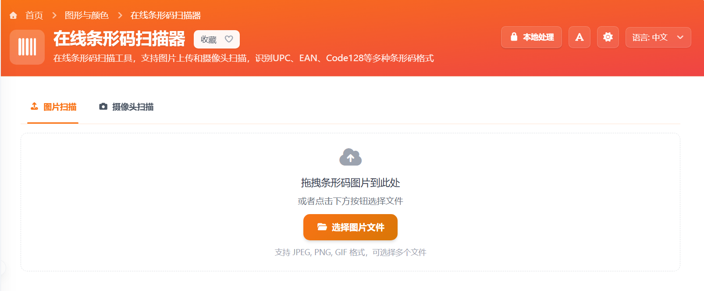

# 在线条形码扫描器分享

超市商品、快递单、图书封底、仓库标签上的条形码，有时候只是想在电脑上快速识别一下内容，不想再拿手机装 App。这个「在线条形码扫描器」就是为这种场景做的，打开浏览器就能用。

这个工具是我用 Vue（基于 Nuxt 3 / Vue 3）开发的，支持图片上传和摄像头实时扫描，常见的 UPC、EAN、Code 128 等格式都能识别。识别过程在浏览器端完成，图片和摄像头画面不会被我单独保存，用起来更直接。

> 在线工具网址：[https://see-tool.com/barcode-scanner](https://see-tool.com/barcode-scanner)  
> 工具截图：  
> 

## 怎么用

1. 打开工具页面：`/barcode-scanner`
2. 选择识别方式：
   - 上传图片：把条形码照片或截图拖进页面，或者点击按钮选择文件
   - 摄像头扫描：允许浏览器使用摄像头，把条形码放到画面中央
3. 等待识别结果出现，页面会显示条码内容和对应格式
4. 点击复制按钮，就能把结果粘贴到表格、聊天窗口或后台系统

## 适合哪些场景

- 查询商品条码、图书编码、包裹标签内容
- 在电脑上整理资料时，直接从截图或照片里提取条码信息
- 临时扫码核对，不想额外安装软件

## 小提醒

- 尽量保证条形码完整、清晰，避免反光、模糊和裁切
- 一维条形码更适合横向铺满画面，距离不要太近
- 如果图片识别不稳定，可以改用摄像头；反过来也一样

如果你经常需要在电脑端查看条形码内容，这个小工具会比来回切换手机更省事。
