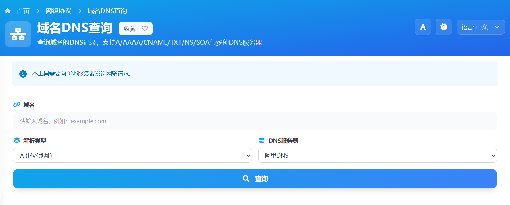

# 在线域名DNS查询工具核心JS实现

这篇文章只讲本项目里“域名DNS查询”工具的功能 JS 实现。整个工具用 Vue 组织交互状态，查询端走 DoH（DNS over HTTPS），最终把 DNS 记录整理成可直接展示的表格数据。

核心链路很简单：

`输入域名 -> 规范化与校验 -> 发起查询 -> 解析应答 -> 渲染记录`

> 在线工具网址：[https://see-tool.com/dns-query](https://see-tool.com/dns-query)  
> 工具截图：  
> 


## 1）输入先做规范化，避免脏数据进入查询

前端不会直接拿输入框原值查询，而是先做统一处理：转小写、去协议、去路径、去端口、去结尾点。

```js
const normalizeDomain = (value) => {
  const rawValue = String(value || "")
    .trim()
    .toLowerCase();
  if (!rawValue) return "";
  let cleaned = rawValue.replace(/^https?:\/\//i, "");
  cleaned = cleaned.split("/")[0].split("?")[0].split("#")[0];
  if (cleaned.includes(":")) cleaned = cleaned.split(":")[0];
  return cleaned.replace(/\.$/, "");
};

const isValidDomain = (value) => {
  if (!value || !value.includes(".")) return false;
  return /^[a-z0-9.-]+$/i.test(value);
};
```

这一步把 `https://Example.com:443/path` 统一成 `example.com`，后续请求参数会稳定很多。

## 2）前端状态围绕“一次查询”组织

在 Vue 里，核心状态包括：

- `domainInput`：用户输入
- `recordType`：记录类型（默认 `1`，即 A）
- `dohServer`：DoH 服务商（默认 `alidns`）
- `isLoading`：查询中状态
- `resultRecords`、`resultDomain`：结果数据

触发查询时会先清空旧结果，再发请求；请求完成后根据返回值决定展示记录表格还是“无记录”提示。`Enter` 键和按钮点击共用同一套查询函数，交互逻辑保持一致。

## 3）服务端对域名再做一次标准化和校验

后端会再次处理输入，保证接口层数据安全、可控。这里做了两件事：

1. 允许传入带协议或带路径的字符串，并用 `URL` 做兜底解析
2. 校验域名格式，不合法直接返回错误

同时接口只接受 `POST`，并把错误按类型转成明确的状态码，前端可以直接按 message 展示。

## 4）DoH 查询的核心是“服务映射 + 类型映射”

工具内部先定义两张映射表：

- DoH 服务商映射：`alidns`、`dnspod`、`360`、`google`、`cloudflare`
- DNS 类型映射：`1(A)`、`28(AAAA)`、`5(CNAME)`、`16(TXT)`、`2(NS)`、`6(SOA)`

查询时先检查映射是否存在，不存在直接抛出 `INVALID_DOH` 或 `INVALID_TYPE`，避免发出无效请求。

```js
const requestUrl = `${server.url}?name=${encodeURIComponent(name)}&type=${encodeURIComponent(typeKey)}`;
const response = await fetchWithTimeout(
  requestUrl,
  {
    method: "GET",
    headers: { Accept: "application/dns-json" },
  },
  10000,
);
```

这里统一用超时封装后的请求函数，避免上游响应异常时长时间卡住。

## 5）把 DoH 原始应答转换成页面可用结构

DoH 返回里真正要展示的是 `Answer` 数组。实现里会做一次轻量转换：保留原字段，同时补一个 `typename`，把数字类型改成可读字符串。

```js
const parseAnswerList = (data) => {
  if (!data || !Array.isArray(data.Answer)) return [];
  return data.Answer.map((row) => ({
    ...row,
    typename: DNS_TYPES[String(row.type)] || String(row.type),
  }));
};
```

这样前端渲染时可以直接显示：主机名、类型、记录值、TTL，不需要再做二次转换。

## 6）错误处理按“可定位”设计

这套实现把错误分成几类：

- 参数错误：如类型非法、DoH 非法
- 上游响应错误：如返回体不是合法 JSON
- 请求失败：上游不可达或超时

接口会返回统一结构，前端只需要读取 `status` 和 `message` 就能完成提示。

## 7）这套功能 JS 的关键点

这个工具的核心不在“把 DNS 查出来”本身，而在于把查询链路标准化：输入规范化、参数校验、DoH 请求、应答转换、结果直出。对用户来说是一次点击；对实现来说是一条清晰的数据处理流水线。
