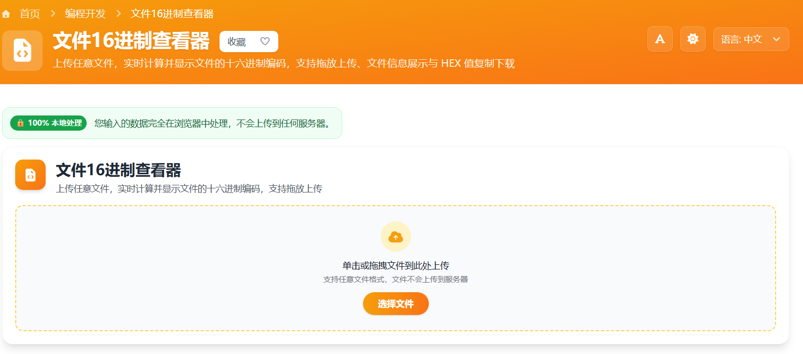

# 文件16进制查看器 在线工具分享

在日常开发和数据分析中，我们经常需要深入文件内部，查看其最原始的二进制数据。无论是为了分析文件头信息、调试网络传输数据，还是进行逆向工程研究，一个好用的十六进制（Hex）查看器都是必不可少的工具。

今天，我想分享一个我最近用 Vue 3 开发的在线工具——**文件16进制查看器**。它无需下载安装，打开网页即可使用，且所有处理都在本地浏览器完成，安全高效。

> 在线工具网址：[https://see-tool.com/file-hex-viewer](https://see-tool.com/file-hex-viewer)  
> 工具截图：  
> 

## 为什么开发这个工具？

虽然市面上有很多 Hex 编辑器软件（如 WinHex、010 Editor），但它们往往需要安装，且功能过于复杂。对于只是想快速查看文件 Hex 编码的场景，一个轻量级的在线工具会更加方便。

## 工具亮点

1.  **纯前端处理，隐私安全**：利用浏览器强大的 `FileReader` API，所有文件读取和转换都在你的本地设备上完成，文件**不会**上传到服务器，确保数据绝对安全。
2.  **支持任意文件类型**：无论是图片、文档、音频还是可执行文件，都可以直接拖入查看。
3.  **多种显示格式**：
    *   **空格分隔**：每字节之间用空格隔开，每16字节换行，通过版式让数据结构一目了然。
    *   **紧凑模式**：无空格连续显示，适合复制到其他代码中。
    *   **大写模式**：支持一键切换大小写（如 `a1` vs `A1`），满足不同系统的格式要求。
4.  **便捷操作**：支持一键复制所有 Hex 数据，或将其导出为 `.hex` 文本文件下载。

## 如何使用

使用非常简单，只需三步：

1.  **上传文件**：点击上传区域选择文件，或者直接将文件拖拽到网页中。
2.  **查看信息**：工具会自动解析并显示文件名、大小、类型和最后修改时间。
3.  **获取 Hex 码**：下方会实时生成十六进制编码。你可以根据需要切换“空格”、“无空格”或“大写”格式，然后点击“复制”或“下载”按钮。

## 技术实现 (Vue 3)

这个工具是基于 **Vue 3** 和 **Nuxt 3** 框架构建的。核心逻辑非常简洁，主要依赖于 HTML5 的 `FileReader` 接口。

当用户选择文件后，我们通过 `readAsArrayBuffer` 方法读取文件内容，得到一个 `ArrayBuffer` 对象。然后，利用 `Uint8Array` 视图遍历二进制数据，将其转换为 16 进制字符串。

```javascript
// 核心转换逻辑示例
const reader = new FileReader()
reader.onload = (e) => {
  const buffer = e.target.result
  const bytes = new Uint8Array(buffer)
  // 转换为 Hex 字符串
  const hex = Array.from(bytes)
    .map(b => b.toString(16).padStart(2, '0'))
    .join(' ')
}
reader.readAsArrayBuffer(file)
```

为了提升用户体验，我还使用了 Vue 的 `computed` 属性来动态响应格式切换，确保在不重新读取文件的情况下即时更新视图。

## 体验地址

欢迎大家体验使用，如果有任何建议或发现 Bug，也欢迎反馈给我！

希望这个小工具能成为你开发工具箱里的得力助手。
