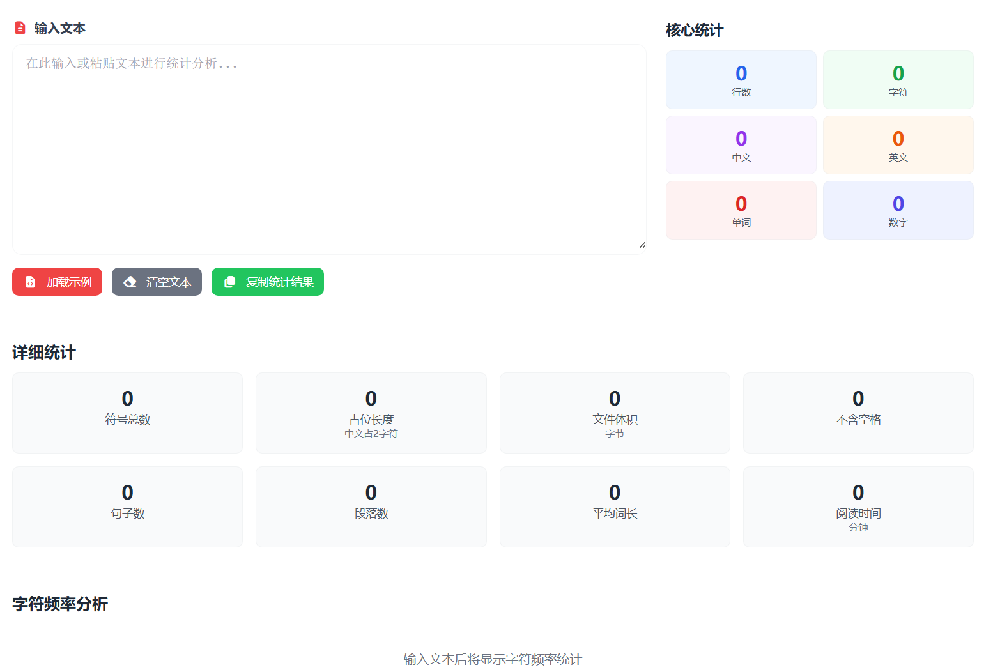

# 文本字符数统计 在线工具核心JS实现

这篇只讲功能层 JavaScript。这个工具的实现方式很直接：用户输入文本后，触发统一统计函数，一次计算出全部指标，再把结果绑定到界面。

> 在线工具网址：[https://see-tool.com/text-character-count](https://see-tool.com/text-character-count)  
> 工具截图：  
> 

## 1. 核心状态

先定义输入文本、统计结果、字符频率三个响应式状态：

```javascript
import { ref } from 'vue'

const inputText = ref('')

const stats = ref({
  lines: 0,
  chars: 0,
  chinese: 0,
  english: 0,
  words: 0,
  numbers: 0,
  symbols: 0,
  displayLength: 0,
  fileSize: 0,
  charsNoSpace: 0,
  sentences: 0,
  paragraphs: 0,
  avgWordLen: '0',
  readTime: 0
})

const charFrequency = ref([])
```

## 2. 统一统计入口函数

输入框 `@input` 直接调用 `updateStatistics`，所有统计都在这个函数里完成：

```javascript
const updateStatistics = () => {
  if (!process.client) return

  const text = inputText.value

  // 行数
  const lines = text ? text.split('\n') : []
  stats.value.lines = lines.length

  // 总字符数
  stats.value.chars = text.length

  // 中文字符数
  const chineseChars = text.match(/[\u4e00-\u9fff]/g) || []
  stats.value.chinese = chineseChars.length

  // 英文字符数
  const englishChars = text.match(/[a-zA-Z]/g) || []
  stats.value.english = englishChars.length

  // 单词数
  const words = text.trim() ? text.trim().split(/\s+/).filter(w => w.length > 0) : []
  stats.value.words = words.length

  // 符号数（排除字母、数字、下划线、空白、中日韩统一表意文字）
  const symbols = text.match(/[^\w\s\u4e00-\u9fff]/g) || []
  stats.value.symbols = symbols.length

  // 数字数
  const numbers = text.match(/[0-9]/g) || []
  stats.value.numbers = numbers.length

  // 显示长度：中文记 2，其它记 1
  let displayLength = 0
  for (const char of text) {
    if (/[\u4e00-\u9fff]/.test(char)) {
      displayLength += 2
    } else {
      displayLength += 1
    }
  }
  stats.value.displayLength = displayLength

  // UTF-8 字节大小
  stats.value.fileSize = new Blob([text]).size

  // 去空白字符数
  stats.value.charsNoSpace = text.replace(/\s/g, '').length

  // 句子数
  const sentences = text.split(/[.!?。！？]+/).filter(s => s.trim().length > 0)
  stats.value.sentences = sentences.length

  // 段落数（空行分隔）
  const paragraphs = text.split(/\n\s*\n/).filter(p => p.trim().length > 0)
  stats.value.paragraphs = paragraphs.length

  // 平均词长
  const avgWordLen = words.length > 0
    ? (words.reduce((sum, w) => sum + w.length, 0) / words.length).toFixed(1)
    : '0'
  stats.value.avgWordLen = avgWordLen

  // 阅读时长（200词/分钟）
  const readTime = Math.ceil(words.length / 200)
  stats.value.readTime = readTime

  updateCharFrequency(text)
}
```

这段代码把基础统计和派生统计放在同一流程，输入变化时只跑一次主函数，逻辑清晰。

## 3. 字符频率分析

字符频率的做法是遍历全文，过滤空白，统一小写，最后排序截断：

```javascript
const updateCharFrequency = (text) => {
  if (!text.trim()) {
    charFrequency.value = []
    return
  }

  const freq = {}
  for (const char of text) {
    if (/\S/.test(char)) {
      const lower = char.toLowerCase()
      freq[lower] = (freq[lower] || 0) + 1
    }
  }

  const sorted = Object.entries(freq)
    .sort((a, b) => b[1] - a[1])
    .slice(0, 20)
    .map(([char, count]) => ({ char, count }))

  charFrequency.value = sorted
}
```

这里 `A` 和 `a` 会被合并统计，更符合实际阅读习惯。

## 4. 复制统计结果

复制逻辑分两层：优先使用 Clipboard API，不可用时自动降级：

```javascript
const formatNumber = (num) => num.toLocaleString()

const copyStats = async (t, MessagePlugin) => {
  if (!process.client) return

  const statsText = [
    t('textCharacterCount.statsResult'),
    '==================',
    `${t('textCharacterCount.lines')}: ${formatNumber(stats.value.lines)}`,
    `${t('textCharacterCount.chars')}: ${formatNumber(stats.value.chars)}`,
    `${t('textCharacterCount.chinese')}: ${formatNumber(stats.value.chinese)}`,
    `${t('textCharacterCount.english')}: ${formatNumber(stats.value.english)}`,
    `${t('textCharacterCount.words')}: ${formatNumber(stats.value.words)}`,
    `${t('textCharacterCount.numbers')}: ${formatNumber(stats.value.numbers)}`,
    `${t('textCharacterCount.symbols')}: ${formatNumber(stats.value.symbols)}`,
    `${t('textCharacterCount.displayLength')}: ${formatNumber(stats.value.displayLength)} (${t('textCharacterCount.displayLengthHint')})`,
    `${t('textCharacterCount.fileSize')}: ${formatNumber(stats.value.fileSize)} ${t('textCharacterCount.bytes')}`,
    `${t('textCharacterCount.charsNoSpace')}: ${formatNumber(stats.value.charsNoSpace)}`,
    `${t('textCharacterCount.sentences')}: ${formatNumber(stats.value.sentences)}`,
    `${t('textCharacterCount.paragraphs')}: ${formatNumber(stats.value.paragraphs)}`,
    `${t('textCharacterCount.avgWordLen')}: ${stats.value.avgWordLen}`,
    `${t('textCharacterCount.readTime')}: ${stats.value.readTime} ${t('textCharacterCount.minutes')}`
  ].join('\n')

  try {
    await navigator.clipboard.writeText(statsText)
    MessagePlugin.success(t('textCharacterCount.messages.copySuccess'))
  } catch {
    const textarea = document.createElement('textarea')
    textarea.value = statsText
    textarea.style.position = 'fixed'
    textarea.style.opacity = '0'
    document.body.appendChild(textarea)
    textarea.select()

    try {
      document.execCommand('copy')
      MessagePlugin.success(t('textCharacterCount.messages.copySuccess'))
    } catch {
      MessagePlugin.error(t('textCharacterCount.messages.copyFailed'))
    }

    document.body.removeChild(textarea)
  }
}
```

## 5. 示例文本与清空

两个动作都很轻：改值 + 重新统计。

```javascript
const loadSample = (t, MessagePlugin) => {
  const sampleText = `Hello World! 这是一个文本统计分析的示例。

这个工具可以统计文本中的字符数、单词数、行数、句子数和段落数。
同时还能分析字符频率，帮助您了解文本的构成特点。`

  inputText.value = sampleText
  updateStatistics()
  MessagePlugin.success(t('textCharacterCount.messages.sampleLoaded'))
}

const clearText = (t, MessagePlugin) => {
  inputText.value = ''
  updateStatistics()
  MessagePlugin.info(t('textCharacterCount.messages.textCleared'))
}
```

## 6. 触发方式

输入区直接绑定：

```html
<textarea v-model="inputText" @input="updateStatistics"></textarea>
```

这种绑定方式保证了“输入即统计”，不需要额外点击计算按钮。
