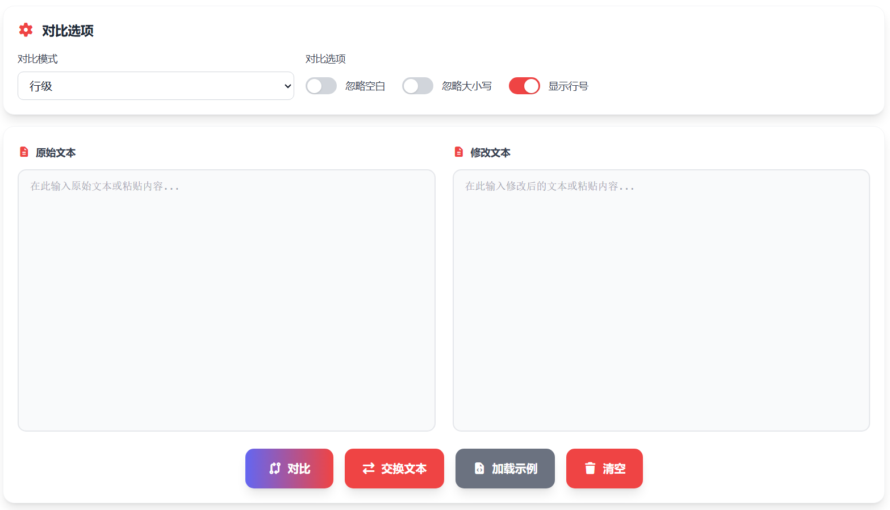

# Vue3文本差异对比器实现方案

本文将介绍本项目中 **文本差异对比器 (Text Diff Checker)** 工具的技术实现细节。该工具基于 Vue 3 框架开发，核心对比逻辑采用原生的 JavaScript 实现，通过动态加载的方式与 Vue 组件进行交互。

> 在线工具网址：[https://see-tool.com/diff-checker](https://see-tool.com/diff-checker)  
> 工具截图：  
> 

## 1. 架构设计

为了保证核心算法的独立性和复用性，我们将 Diff 算法逻辑封装在 `public/js/diff-checker.js` 中，而 Vue 组件 `pages/diff-checker.vue` 仅负责 UI 交互和数据展示。

*   **数据层 (Core JS)**: 负责文本的预处理、Diff 算法计算、HTML 渲染字符串生成以及统计信息计算。
*   **视图层 (Vue)**: 负责用户输入、选项配置、调用核心方法并展示结果。

## 2. 核心算法实现 (diff-checker.js)

核心逻辑是一个基于 **最长公共子序列 (LCS, Longest Common Subsequence)** 的 Diff 算法。

### 2.1 文本预处理与并在

根据用户选择的“对比模式”，我们将输入文本分割成不同的单元：
*   **行模式 (Line)**: 使用 `split('\n')` 按换行符分割。
*   **词模式 (Word)**: 使用 `split(/\s+/)` 按空白字符分割。
*   **字符模式 (Char)**: 使用 `split('')` 逐字符分割。

同时，根据配置选项处理“忽略空格”和“忽略大小写”：
```javascript
if (ignoreWhitespace) {
    processedText1 = processedText1.replace(/\s+/g, ' ').trim();
    processedText2 = processedText2.replace(/\s+/g, ' ').trim();
}
// 忽略大小写则统一转为小写
```

### 2.2 LCS 算法与回溯

使用动态规划构建 DP 表，计算最长公共子序列的长度：
```javascript
// DP 表构建
for (let i = 1; i <= m; i++) {
    for (let j = 1; j <= n; j++) {
        if (arr1[i - 1] === arr2[j - 1]) {
            dp[i][j] = dp[i - 1][j - 1] + 1;
        } else {
            dp[i][j] = Math.max(dp[i - 1][j], dp[i][j - 1]);
        }
    }
}
```
构建完成后，通过回溯 (Backtrack) 找出具体的 LCS 路径。

### 2.3 构建 Diff 结果

根据 LCS 路径，遍历原始序列，确定哪些部分是“新增 (added)”、“删除 (removed)”或“未变 (unchanged)”。
*   如果当前元素在 LCS 中，标记为 `unchanged`。
*   如果原序列中有但 LCS 中没有，标记为 `removed`。
*   如果新序列中有但 LCS 中没有，标记为 `added`。

### 2.4 结果渲染

为了提高性能，Diff 的结果直接由 JS 生成 HTML 字符串，而不是在 Vue 中使用 `v-for` 渲染成千上万个 DOM 节点。生成的 HTML 包含了行号、差异标识（+/-）以及高亮样式类。

```javascript
/* 生成的 HTML 结构示例 */
<div class="diff-line diff-line-removed">
  <span class="diff-line-number">1</span>
  <span class="diff-line-number"></span>
  <span class="mr-2">-</span>
  Content
</div>
```

## 3. Vue 组件实现 (diff-checker.vue)

### 3.1 动态加载脚本

Vue 组件在挂载或需要使用时，通过创建 `<script>` 标签动态加载核心 JS 文件。为了防止重复加载，我们通过检查 `window.DiffChecker` 是否存在来判断。

```javascript
const loadDiffCheckerScript = () => {
  if (window.DiffChecker) return Promise.resolve();
  // 创建 script 标签加载 /js/diff-checker.js
  // 监听 onload 和 onerror 事件
}
```

### 3.2 调用对比

当用户点击“开始对比”时，组件收集 `leftText`、`rightText` 以及 `compareMode`、`ignoreWhitespace` 等选项，调用核心对象的 `compare` 方法：

```javascript
const result = window.DiffChecker.compare(leftText.value, rightText.value, compareMode.value, {
  ignoreWhitespace: ignoreWhitespace.value,
  ignoreCase: ignoreCase.value,
  showLineNumbers: showLineNumbers.value
})
```

### 3.3 结果展示

核心方法返回的 `result` 对象中包含了 `diffHtml`（差异内容的 HTML）和 `statisticsHtml`（统计信息的 HTML）。Vue 组件直接使用 `v-html` 指令将其渲染到页面上：

```html
<div v-if="statisticsHtml" v-html="statisticsHtml"></div>
<div ref="diffOutput" v-html="diffOutputHtml"></div>
```

通过这种 Vue 处理交互 + 原生 JS 处理计算密集任务的分离模式，我们既保持了前端框架的开发效率，又保证了对比功能的性能与灵活性。
