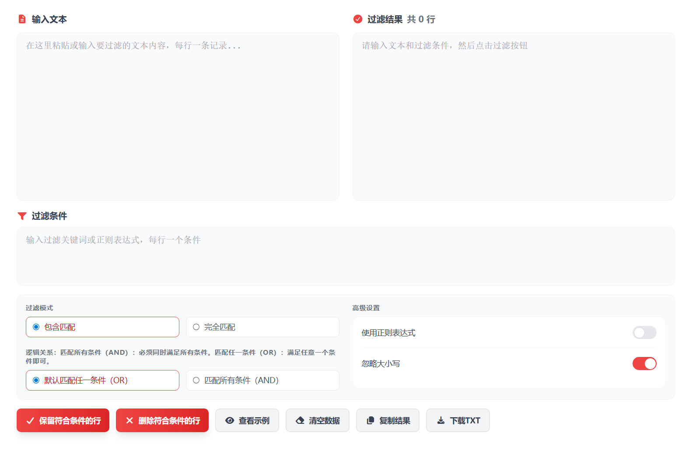

# 文本行过滤/筛选 在线工具分享

处理名单、日志、关键词时，很多人都会遇到同一个问题：只想保留有用的行，或者快速删掉无关内容。为了让普通用户不写代码也能完成这件事，我用 **Vue 3（Nuxt 3）** 开发了一个「文本行过滤/筛选」在线工具，打开网页粘贴文本就能直接用。

> 在线工具网址：[https://see-tool.com/text-line-filter](https://see-tool.com/text-line-filter)  
> 工具截图：  
> 

这个工具常见的使用场景有：

- 从长日志中只保留包含某个词的行
- 批量删除空行、重复行、注释行
- 按前缀或后缀筛选账号、订单号、URL
- 导出前先清洗文本，让内容更整齐

使用步骤也很简单：

1. 将原始文本粘贴到输入框（支持多行）。
2. 选择筛选方式，如“包含关键词”“排除关键词”“正则匹配”“去重”“去空行”。
3. 按需要开启大小写敏感、整词匹配等条件。
4. 点击开始处理，结果会立即生成。
5. 一键复制或下载处理后的文本。

为了让新手更容易上手，我把交互做得尽量直观：你可以看到命中行数和总行数，方便判断筛选是否准确；切换条件后结果会即时更新，减少来回试错。

这个工具不需要安装软件，电脑和手机浏览器都可以使用。文本处理在本地浏览器完成，不必上传原文，日常使用更省心。如果你经常整理文本、日志或名单，这类行级筛选工具会比手动逐行编辑快很多。
