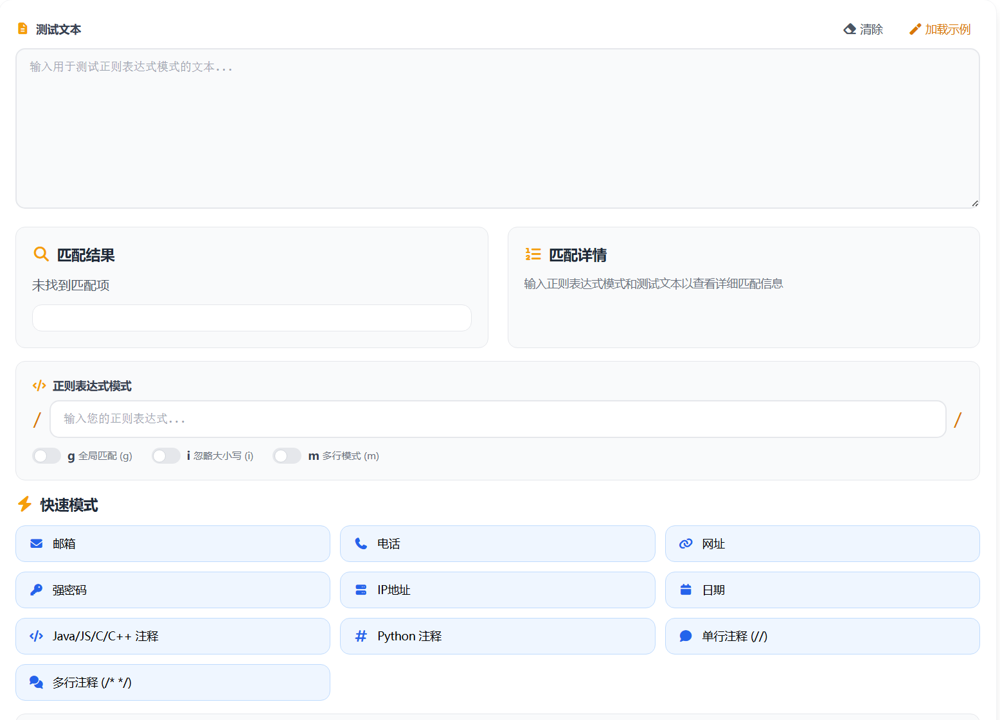

# 正则表达式测试 在线工具分享

大家好！今天我要给大家分享一个日常开发中非常实用的小工具——正则表达式测试工具。

> 在线工具网址：[https://see-tool.com/regex-tester](https://see-tool.com/regex-tester)  
> 工具截图：  
> 

## 什么是正则表达式？

正则表达式（Regular Expression）是一种强大的文本匹配模式，可以用来验证、搜索、替换字符串。比如检查手机号格式、提取邮箱地址、过滤敏感词等，都离不开它。不过正则表达式语法比较抽象，写错了调试起来特别麻烦，这时候一个好用的在线测试工具就很重要了。

## 工具功能介绍

这个正则表达式测试工具是我用 Vue 开发的一个网页应用，主要包含以下核心功能：

### 1. 实时匹配预览
在测试文本区域输入任意内容，写好正则表达式后，工具会即时高亮显示所有匹配结果。匹配到的内容会用不同颜色标注，一目了然。

### 2. 匹配详情查看
工具会详细列出每个匹配项的位置索引、分组捕获内容等信息，方便你理解正则的具体匹配行为。

### 3. 正则标志位开关
支持切换三种常用标志：
- **g**：全局匹配，找到所有匹配项
- **i**：忽略大小写
- **m**：多行模式

### 4. 常用正则模板
内置了手机号、邮箱、URL、身份证号等多种常用正则模板，点击即可快速应用，再也不用记那些复杂的语法了。

### 5. 替换功能
支持正则替换操作，可以实时查看替换后的结果，还提供 $1、$2 等分组引用语法。

## 使用场景

- 验证用户输入格式（手机号、邮箱、身份证等）
- 提取网页或文本中的特定内容
- 批量替换符合某种规则的文字
- 学习正则表达式时进行练习测试

## 总结

正则表达式是编程基本功，而这个在线测试工具让调试变得简单直观。有需要的朋友可以直接在线使用，有任何问题也欢迎反馈交流！
