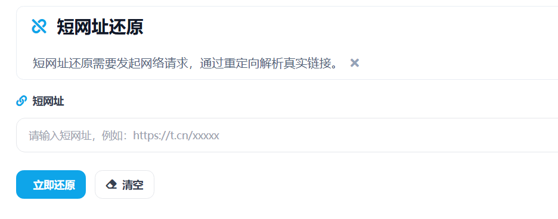

# 短网址还原 在线工具核心JS实现

这篇只讲“短网址还原”工具的功能层 JavaScript 实现。工具由我用 Vue 开发，核心目标是把短链接还原成真实地址，并把状态结果清晰返回给页面。

整体链路可以概括成：

`输入短链 -> URL规范化 -> 请求还原接口 -> 探测重定向 -> 返回长链接 -> 前端展示与复制`

> 在线工具网址：[https://see-tool.com/short-url-restore](https://see-tool.com/short-url-restore)  
> 工具截图：  
> 

## 1）先统一 URL，避免无效输入进入流程

前端和服务端都做了 URL 规范化：去空格、补协议、限制协议类型。

```js
function normalizeUrl(input) {
  const rawValue = String(input || "").trim();
  if (!rawValue) return "";

  const withProtocol = /^https?:\/\//i.test(rawValue)
    ? rawValue
    : `http://${rawValue}`;

  try {
    const target = new URL(withProtocol);
    if (!["http:", "https:"].includes(target.protocol)) return "";
    return target.toString();
  } catch {
    return "";
  }
}
```

这样像 `t.cn/xxxx` 这类输入会先转成可请求格式，非法链接会在入口直接拦截。

## 2）重定向探测的核心：`manual` + `HEAD/GET` 双策略

短链还原的关键不是“访问页面内容”，而是拿到跳转位置（`Location`）。

实现里请求时关闭自动跳转，手动读取响应头：

```js
async function requestRedirect(shortUrl, method) {
  const response = await fetchWithTimeout(
    shortUrl,
    {
      method,
      redirect: "manual",
      headers: BUILD_HEADERS,
    },
    30000,
  );

  return {
    status: response.status,
    location:
      response.headers.get("location") ||
      response.headers.get("x-redirect-location") ||
      "",
  };
}
```

然后做一次策略兜底：先 `HEAD`，拿不到跳转或服务端不支持时再切 `GET`。

```js
async function fetchRedirectInfo(shortUrl) {
  const headResult = await requestRedirect(shortUrl, "HEAD");
  if (headResult.location) return headResult;
  if (headResult.status === 405) return await requestRedirect(shortUrl, "GET");
  if (headResult.status < 400) return await requestRedirect(shortUrl, "GET");
  return headResult;
}
```

这一步能覆盖很多短链服务的差异行为，减少“明明可跳转却还原失败”的情况。

## 3）把相对跳转地址补全成可直接打开的长链接

有些服务返回的 `Location` 可能是相对路径，不是完整 URL。这里用基准地址做拼接：

```js
function resolveLocation(location, baseUrl) {
  try {
    return new URL(location, baseUrl).toString();
  } catch {
    return location;
  }
}
```

这样前端拿到的结果始终可读、可复制、可直接打开。

## 4）返回数据结构保持稳定，前端展示更简单

服务端输出统一结构：

- 有跳转：`shortUrl + longUrl + statusCode`
- 无跳转但请求成功：`longUrl` 等于 `shortUrl`
- 上游异常：返回错误消息

前端只要判断 `status` 是否为 `ok`，就能决定展示结果卡片还是错误提示，不需要写复杂分支。

## 5）Vue 侧交互状态围绕“一次还原”组织

页面核心状态主要有：

- `urlInput`：输入框内容
- `isLoading`：请求中状态
- `resultData`：还原结果
- `errorMessage`：错误提示
- `copied`：复制反馈状态

触发还原时，流程是：校验输入 -> 规范化 -> 清空旧结果 -> 发请求 -> 写入结果或错误。

```js
async function restoreShortUrlInternal(url) {
  const response = await fetch("/api/short-url-restore", {
    method: "POST",
    headers: { "Content-Type": "application/json" },
    body: JSON.stringify({ url }),
  });

  const data = await response.json();
  if (!response.ok || data.status !== "ok") {
    throw new Error(data.message || "restore failed");
  }

  return data.data;
}
```

这套状态流让页面行为比较稳定：请求开始时按钮进入加载态，请求结束后统一收口到结果或提示。

## 6）复制功能做了兼容回退

结果里最常用的是“复制长链接”。实现优先使用 `navigator.clipboard`，失败时回退到 `textarea + execCommand('copy')`，保证常见浏览器环境下都能完成复制。

```js
async function copyTextToClipboard(text) {
  try {
    await navigator.clipboard.writeText(text);
    return true;
  } catch {
    const textarea = document.createElement("textarea");
    textarea.value = text;
    textarea.style.position = "fixed";
    textarea.style.opacity = "0";
    document.body.appendChild(textarea);
    textarea.select();
    document.execCommand("copy");
    document.body.removeChild(textarea);
    return true;
  }
}
```

对用户来说，点击复制后能立即得到成功反馈，操作路径很短。

短网址还原这个工具的核心 JS，本质上是在做一条稳定的数据处理流水线：输入规范化、重定向探测、结果标准化、前端状态收口。用 Vue 承接这条链路后，交互和结果都能保持一致。
