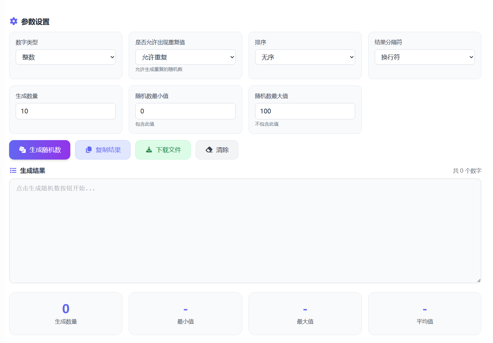

# 简单随机数生成器 在线工具分享

日常抽奖、点名、分组、测试数据时，经常会用到随机数。相比手动输入或套公式，这个在线工具打开就能用，电脑和手机都方便。

这个简单随机数生成器是我用 Vue 开发的，重点是上手快、操作清晰。你只需要设置范围和数量，就能马上得到结果，不用注册，也不用下载安装软件。

> 在线工具网址：[https://see-tool.com/random-number-generator](https://see-tool.com/random-number-generator)  
> 工具截图：  
> 

## 这个工具能做什么

- 按区间生成随机整数或小数
- 一次生成多个结果，适合批量使用
- 支持去重，避免抽样重复
- 可选升序或降序，方便直接粘贴到表格
- 结果支持一键复制，减少手工整理

## 三步就能完成

1. 输入最小值、最大值和生成数量。
2. 按需求勾选去重、排序；如果是小数场景，再设置小数位数。
3. 点击生成，满意就复制，不满意可立即重抽。

## 适合哪些场景

- 学生：随机点名、练习题取值
- 老师或运营：活动抽取、名单分组
- 办公人群：测试数据、编号样例
- 开发与测试：快速生成一批可控数字

## 使用小提醒

如果开启去重，生成数量不能超过区间内可选值；如果你更关注分布效果，可以多生成几次再观察结果。

我做这个工具的目标很简单：让“生成随机数”这件小事更省时间。希望它能帮你减少重复操作，把精力留给更重要的事情。
