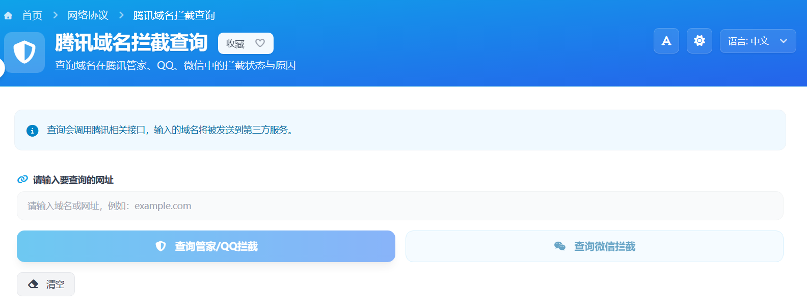

# 腾讯域名拦截查询 在线工具核心JS实现

这篇只讲功能层 JavaScript/TypeScript 实现，围绕“输入一个域名，得到可读的拦截状态”这一条主链路展开。

工具有两条查询通道（第三方接口）：

- QQ通道：`https://cgi.urlsec.qq.com/index.php?m=check&a=gw_check&callback=url_query&url={url}&ticket={ticket}&randstr={randstr}&_={timestamp}`
- 微信通道：`https://cgi.urlsec.qq.com/index.php?m=url&a=validUrl&url={url}`

> 在线工具网址：[https://see-tool.com/tencent-domain-block-query](https://see-tool.com/tencent-domain-block-query)  
> 工具截图：  
> 


## 1. 输入规范化是第一道关口

这个工具不直接信任用户输入，而是统一走 `normalizeInput`：

```javascript
const normalizeInput = (value) => {
  const rawValue = String(value || '').trim()
  if (!rawValue) return ''

  const cleaned = rawValue.replace(/\s+/g, '')
  const withProtocol = /^https?:\/\//i.test(cleaned) ? cleaned : `http://${cleaned}`

  try {
    const url = new URL(withProtocol)
    if (!['http:', 'https:'].includes(url.protocol)) return ''
    return url.toString()
  } catch {
    return ''
  }
}
```

这里做了三件关键事：去空白、补协议、用 `URL` 做结构化校验。后续所有请求都只使用规范化后的值。

## 2. 查询动作编排

点击查询时，动作顺序是固定的：

1. 判空
2. 规范化
3. 清理旧结果
4. 标记查询通道
5. 进入对应通道请求

```javascript
const startQqQuery = () => {
  if (!input.value.trim()) {
    errorMessage.value = '请输入要查询的域名'
    return
  }

  const normalized = normalizeInput(input.value)
  if (!normalized) {
    errorMessage.value = '请输入有效的网址'
    return
  }

  input.value = normalized
  errorMessage.value = ''
  resultData.value = null
  lastQueryType.value = 'qq'
  submitQqQuery(normalized, ticket, randstr)
}

const startWeChatQuery = () => {
  if (!input.value.trim()) {
    errorMessage.value = '请输入要查询的域名'
    return
  }

  const normalized = normalizeInput(input.value)
  if (!normalized) {
    errorMessage.value = '请输入有效的网址'
    return
  }

  input.value = normalized
  errorMessage.value = ''
  resultData.value = null
  lastQueryType.value = 'wx'
  submitWeChatQuery(normalized, captchaPayload)
}
```

这一层不做网络请求细节，只负责把交互状态整理干净。

## 3. 请求提交与异常回传

真正请求在 `submit` 函数里，统一处理 `loading`、异常捕获和结果写入。两条通道分别请求不同第三方 API。

```javascript
const submitQqQuery = async (url, ticket, randstr) => {
  loading.value = true
  errorMessage.value = ''

  try {
    const apiUrl = `https://cgi.urlsec.qq.com/index.php?m=check&a=gw_check&callback=url_query&url=${encodeURIComponent(
      url
    )}&ticket=${encodeURIComponent(ticket)}&randstr=${encodeURIComponent(randstr)}&_=${Date.now()}123`

    const response = await fetch(apiUrl, {
      method: 'GET',
      headers: {
        Referer: 'https://urlsec.qq.com/check.html',
        'User-Agent':
          'Mozilla/5.0 (Windows NT 10.0; WOW64) AppleWebKit/537.36 (KHTML, like Gecko) Chrome/86.0.4240.198 Safari/537.36',
        Accept: 'application/json',
        'Accept-Language': 'zh-CN,zh;q=0.8',
        Connection: 'close'
      }
    })

    const text = await response.text()
    const data = parseJsonp(text)
    if (!data || data.reCode !== 0 || !data.data?.results) {
      throw new Error(data?.data || '查询失败')
    }

    resultData.value = buildQqResult(url, data.data.results)
  } catch (error) {
    errorMessage.value = error?.message || '查询失败'
  } finally {
    loading.value = false
  }
}

const submitWeChatQuery = async (url, captchaPayload) => {
  loading.value = true
  errorMessage.value = ''

  try {
    const apiUrl = `https://cgi.urlsec.qq.com/index.php?m=url&a=validUrl&url=${encodeURIComponent(url)}`

    const response = await fetch(apiUrl, {
      method: 'GET',
      headers: {
        Referer: 'https://urlsec.qq.com/check.html',
        'User-Agent':
          'Mozilla/5.0 (Windows NT 10.0; WOW64) AppleWebKit/537.36 (KHTML, like Gecko) Chrome/86.0.4240.198 Safari/537.36',
        Accept: 'application/json',
        'Accept-Language': 'zh-CN,zh;q=0.8',
        Connection: 'close'
      }
    })

    const text = await response.text()
    const data = JSON.parse(text)
    const isBlocked = data.data === 'ok'

    resultData.value = {
      url,
      status: {
        type: isBlocked ? 'wechat_blocked' : 'wechat_safe'
      }
    }
  } catch (error) {
    errorMessage.value = error?.message || '查询失败'
  } finally {
    loading.value = false
  }
}
```

前端只认统一的返回结构：`{ status: 'ok', data: ... }`。

## 4. 服务端 URL 清洗与请求拦截

服务端入口先拦截无效请求，再代理到上游接口：

```typescript
const normalizeUrl = (input: string) => {
  const rawValue = String(input || '').trim()
  if (!rawValue) return ''

  const cleaned = rawValue.replace(/\s+/g, '')
  const withProtocol = /^https?:\/\//i.test(cleaned) ? cleaned : `http://${cleaned}`

  try {
    const target = new URL(withProtocol)
    if (!['http:', 'https:'].includes(target.protocol)) return ''
    return target.toString()
  } catch {
    return ''
  }
}

if (!url) {
  setResponseStatus(event, 400)
  return { status: 'error', message: 'Invalid url' }
}
```

这样可以保证前后端都执行相同的输入约束，避免脏数据直接进入上游请求。

## 5. QQ通道：JSONP 解析与状态映射

QQ通道第三方接口：`https://cgi.urlsec.qq.com/index.php?m=check&a=gw_check&callback=url_query&url={url}&ticket={ticket}&randstr={randstr}&_={timestamp}`。

QQ通道返回的是 JSONP，不是纯 JSON，所以先解包：

```typescript
const parseJsonp = (jsonpStr: string) => {
  const match = jsonpStr.match(/url_query\((.+)\)/)
  if (match && match[1]) {
    try {
      return JSON.parse(match[1])
    } catch {
      return null
    }
  }
  return null
}
```

拿到对象后，再把复杂字段折叠成前端可消费的数据模型：

```typescript
if (result.whitetype === 3 || result.whitetype === 4) {
  data.status.type = 'whitelist'
} else if (result.whitetype === 2) {
  data.status.type = 'blocked'
  data.status.wordingTitle = result.WordingTitle || ''
  data.status.wording = result.Wording || ''
} else if (result.whitetype === 1) {
  if (result.eviltype === 2800 || result.eviltype === 2804) {
    data.status.type = 'qq_blocked'
  } else if (result.eviltype && result.eviltype !== 0) {
    data.status.type = 'other_blocked'
    data.status.evilType = result.eviltype
  } else {
    data.status.type = 'safe'
  }
}
```

这一步的重点不是“原样透传”，而是“转成稳定业务语义”。

## 6. 微信通道：返回值压平

微信通道第三方接口：`https://cgi.urlsec.qq.com/index.php?m=url&a=validUrl&url={url}`。

微信查询通道返回结构更简单，核心逻辑就是把上游标记转成统一状态：

```typescript
const isBlocked = data.data === 'ok'

return {
  status: 'ok',
  data: {
    url,
    status: {
      type: isBlocked ? 'wechat_blocked' : 'wechat_safe'
    }
  }
}
```

两条通道虽然来源不同，但最终都对齐到 `data.status.type`，前端渲染就能复用同一套逻辑。

## 7. 结果渲染：从对象到行数据

页面不直接硬编码每一行，而是先把结果对象转换成 `resultRows`：

```javascript
const resultRows = computed(() => {
  const data = resultData.value
  if (!data) return []

  const rows = []
  const addRow = (key, label, value, extra = {}) => {
    if (value === undefined || value === null || value === '') return
    rows.push({ key, label, value, ...extra })
  }

  addRow('url', '检测地址', data.url)
  addRow('status', '检测结果', statusText.value, { isStatus: true, toneClass: statusTone.value })

  if (data.status?.wordingTitle) addRow('reasonTitle', '原因标题', data.status.wordingTitle)
  if (data.status?.wording) addRow('reasonDetail', '原因详情', data.status.wording)

  return rows
})
```

这种“先标准化、再渲染”的模式，能让字段增减时只改一处映射逻辑。

到这里，核心链路就是：输入标准化 → 查询编排 → 服务端映射 → 统一结果模型 → 页面渲染。
