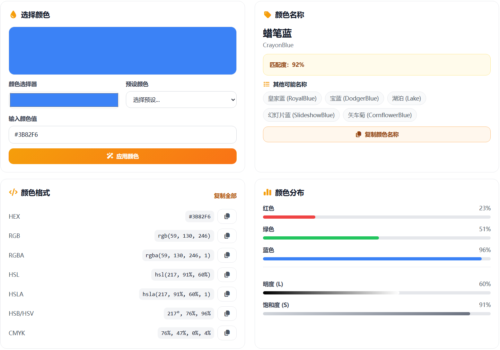

# 色彩命名在线工具分享

有时候我们手里只有一串颜色值，却不知道它对应的颜色名称，也不知道和哪些颜色接近。为了解决这个问题，我用 **Vue 3** 做了一个色彩命名在线工具，打开就能用，适合普通用户快速查色。

> 在线工具网址：[https://see-tool.com/color-naming](https://see-tool.com/color-naming)  
> 工具截图：  
> 

这个工具可以帮你做这些事：

- 输入 HEX、RGB、HSL，自动识别颜色名称
- 支持直接输入中文或英文颜色名
- 同时输出多种格式，方便复制到设计或代码中
- 给出相近颜色列表，便于对比选择
- 生成常用配色方案，快速找灵感

使用步骤很简单：

1. 在输入框里粘贴颜色值（例如 `#FF7F50` 或 `rgb(255, 127, 80)`）
2. 点击应用，立即看到颜色名称与相似色
3. 需要时直接复制 HEX、RGB、HSL 等格式
4. 想做配色就切换到配色方案，一键生成色板

我平时会用它来做配色参考、确认颜色名称，以及快速转格式。整体体验是：输入直观、结果清晰、复制方便，适合随用随走。

如果你经常处理颜色值，或者需要快速判断颜色名称和相似色，这个工具会很实用。
