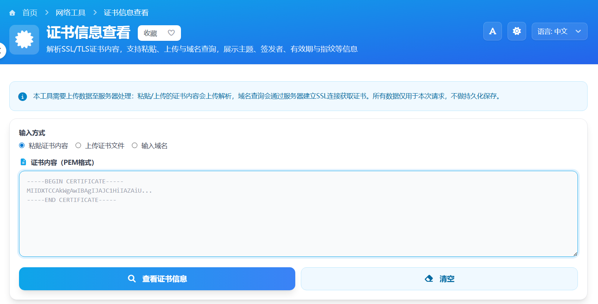

这篇文章想分享一个我自己用 Vue 开发的小工具——「证书信息查看」。它可以帮你快速查看网站 SSL/TLS 证书的详细信息，不需要安装软件、也不需要懂太多专业名词，打开网页就能用。

> 在线工具网址：[https://see-tool.com/certificate-info-viewer](https://see-tool.com/certificate-info-viewer)  
> 工具截图：  
> 

### 这个工具能做什么

- **一键查看网站证书信息**：输入域名，就能看到证书的签发机构、适用域名、有效期等关键信息，方便判断站点是否可靠。  
- **解析粘贴的证书内容**：支持直接粘贴 PEM 格式证书文本，页面会自动解析出结构化的信息。  
- **上传本地证书文件**：如果你从服务器导出了证书文件，也可以上传后在线查看内容。  

### 适合哪些人使用

- **普通用户**：想简单确认某个网站的证书是否过期、是不是正规机构签发。  
- **站长 / 运维同学**：快速核对证书是否部署正确、链路是否完整。  
- **对安全感兴趣的同学**：想直观了解「数字证书」到底长什么样、里面都写了什么。  

### 如何使用这个工具

1. 打开「证书信息查看」页面后，在顶部选择使用方式：输入域名、粘贴证书文本，或上传文件。  
2. 点击「解析」或「查询」按钮，等待几秒钟，页面会展示证书主题、签发者、有效期、指纹等信息。  
3. 对于域名查询的结果，还可以对照浏览器地址栏的小锁图标，验证当前访问的网站是否一致。  

### 关于隐私与安全

工具的设计初衷是：**帮助用户更安全地上网，而不是收集任何隐私信息**。你粘贴或上传的证书内容只用于当前会话的解析展示，不会用于其他用途。  

### 简单说说技术实现

这个工具是我基于 **Vue 3** 开发的前端页面，再结合后端接口做了一些辅助查询和解析工作。页面交互尽量做得简单直观，普通用户只要会输入网址、点击按钮，就可以完成证书信息的查看。  

如果你对数字证书和网站安全感兴趣，不妨打开这个「证书信息查看」在线工具亲自体验一下，也欢迎把它分享给身边的同事或朋友。  

